# Notch_Analysis

## Overview

This vignette demonstrates the application of PathwayEmbed in a
Notch-perturbed system (Ncstn fl/fl cKO bone marrow) and in aging
SSPCs.  
Reference: Remark et al., *Bone Res* 11, 50 (2023).
<https://doi.org/10.1038/s41413-023-00283-8>

------------------------------------------------------------------------

## Load Packages

``` r
library(Seurat)
library(PathwayEmbed)
library(ggplot2)
library(dplyr)
library(patchwork)
library(pheatmap)
library(tidyr)
library(pROC)
```

------------------------------------------------------------------------

## Helper: Annotation Label Builder

``` r
make_label <- function(stats, group1, group2) {
  d    <- round(stats$cohens_d[1], 3)
  p    <- formatC(stats$p_value[1], format = "e", digits = 2)
  on1  <- stats$percentage_on[stats$group  == group1]
  off1 <- stats$percentage_off[stats$group == group1]
  on2  <- stats$percentage_on[stats$group  == group2]
  off2 <- stats$percentage_off[stats$group == group2]
  paste0(
    group1, ": ON=", on1,  "%, OFF=", off1, "%\n",
    group2, ": ON=", on2,  "%, OFF=", off2, "%\n",
    "Cohen's d = ", d, "\n",
    "p = ", p
  )
}
```

------------------------------------------------------------------------

## Data Preprocessing — WT vs. KO (Ncstn cKO)

The block below is `eval=FALSE` because the raw 10X data are large. The
pre-processed SSPC subset (`COI_2`) is loaded directly from the package
in the next chunk.

``` r
wt_data <- Read10X(data.dir = "path/to/WT", gene.column = 2)
ko_data <- Read10X(data.dir = "path/to/KO", gene.column = 2)

wt_seurat <- CreateSeuratObject(counts = wt_data, project = "WT")
ko_seurat <- CreateSeuratObject(counts = ko_data, project = "KO")
wt_seurat$condition <- "WT"
ko_seurat$condition <- "KO"

combined          <- merge(wt_seurat, y = ko_seurat,
                           add.cell.ids = c("WT", "KO"), project = "WT_vs_KO")
combined[["RNA"]] <- JoinLayers(combined[["RNA"]])

combined[["percent.mt"]] <- PercentageFeatureSet(combined, pattern = "^mt-")
combined <- subset(combined,
                   subset = nFeature_RNA > 200 &
                            nFeature_RNA < 2000 &
                            percent.mt  < 10)

combined <- NormalizeData(combined, normalization.method = "LogNormalize",
                          scale.factor = 10000)
combined <- FindVariableFeatures(combined, selection.method = "vst",
                                 nfeatures = 2000)
combined <- ScaleData(combined)
combined <- RunPCA(combined)
ElbowPlot(combined, ndims = 50)
combined <- FindNeighbors(combined, dims = 1:20)
combined <- FindClusters(combined, resolution = 1)
combined <- RunUMAP(combined, dims = 1:20)

DimPlot(combined, label = TRUE)
FeaturePlot(combined, "Cxcl12")
FeaturePlot(combined, "Kitl")

COI_2 <- subset(combined, subset = seurat_clusters %in% c("23", "25"))
```

------------------------------------------------------------------------

## Notch Signaling in Ncstn KO vs. WT SSPCs

``` r
COI_2_matrix   <- as.matrix(GetAssayData(COI_2, assay = "RNA", layer = "data"))
COI_2_metadata <- COI_2@meta.data

# Load both Notch databases
ListPathway("NOTCH")
#> # A tibble: 6 × 8
#>   Pathway Sheet.Name GEO.Accession Condition Cell.Source Species No..Genes Notes
#>   <chr>   <chr>      <chr>         <chr>     <chr>       <chr>       <dbl> <chr>
#> 1 NOTCH   NOTCH_JAG1 GSE223735     rJAG1 li… Mouse embr… Mouse           5 NA   
#> 2 NOTCH   NOTCH_CB1… GSE221577     CB-103 N… RPMI-8402 … Human          46 NA   
#> 3 NOTCH   NOTCH_LY_… GSE221577     LY411575… RPMI-8402 … Human          46 NA   
#> 4 NOTCH   NOTCH_JAG… GSE235637     JAG1 sti… SVG-A cells Human          11 NA   
#> 5 NOTCH   NOTCH_JAG… GSE235637     JAG1 sti… SVG-A cells Human          11 NA   
#> 6 NOTCH   NOTCH_JAG… GSE235637     JAG1 sti… SVG-A cells Human          11 NA
pathwaydata_mus  <- LoadPathway("NOTCH_JAG1",     "mouse")  # mouse perturbation data
pathwaydata_24hr <- LoadPathway("NOTCH_JAG1_24H", "mouse")  # human 24hr (cross-species)

matrix_mus  <- DataPreProcess(COI_2_matrix, pathwaydata_mus,  Seurat.object = FALSE)
matrix_24hr <- DataPreProcess(COI_2_matrix, pathwaydata_24hr, Seurat.object = FALSE)

pathwaystat_mus  <- PathwayMaxMin(matrix_mus,  pathwaydata_mus)
pathwaystat_24hr <- PathwayMaxMin(matrix_24hr, pathwaydata_24hr)

Notch_score_mus  <- ComputeCellData(matrix_mus,  pathwaystat_mus)
Notch_score_24hr <- ComputeCellData(matrix_24hr, pathwaystat_24hr)

to_plot_1 <- PreparePlotData(COI_2_metadata, Notch_score_mus,  "condition")
to_plot_2 <- PreparePlotData(COI_2_metadata, Notch_score_24hr, "condition")

pct_1 <- CalculatePercentage(to_plot_1, "condition")
pct_2 <- CalculatePercentage(to_plot_2, "condition")
pct_1; pct_2
#> # A tibble: 2 × 5
#>   group percentage_on percentage_off cohens_d p_value
#>   <chr>         <dbl>          <dbl>    <dbl>   <dbl>
#> 1 WT             46             54      0.369   0.141
#> 2 KO             35.4           64.6    0.369   0.141
#> # A tibble: 2 × 5
#>   group percentage_on percentage_off cohens_d p_value
#>   <chr>         <dbl>          <dbl>    <dbl>   <dbl>
#> 1 WT             52             48      0.553 0.00519
#> 2 KO             34.5           65.5    0.553 0.00519

# Database comparison: gene overlap and coefficient agreement
genes_mus  <- pathwaydata_mus$Gene_Symbol
genes_24hr <- pathwaydata_24hr$Gene_Symbol
shared     <- intersect(genes_mus, genes_24hr)

cat("Genes in mouse database:      ", length(genes_mus),  "\n")
#> Genes in mouse database:       5
cat("Genes in human 24hr database: ", length(genes_24hr), "\n")
#> Genes in human 24hr database:  9
cat("Shared genes:                 ", length(shared),     "\n")
#> Shared genes:                  4
cat("Unique to mouse database:     ", length(setdiff(genes_mus, genes_24hr)), "\n")
#> Unique to mouse database:      1
cat("Unique to 24hr database:      ", length(setdiff(genes_24hr, genes_mus)), "\n")
#> Unique to 24hr database:       5

coef_mus   <- setNames(pathwaydata_mus$Coefficient,  pathwaydata_mus$Gene_Symbol)
coef_24hr  <- setNames(pathwaydata_24hr$Coefficient, pathwaydata_24hr$Gene_Symbol)
coef_agree <- mean(sign(coef_mus[shared]) == sign(coef_24hr[shared]), na.rm = TRUE)
cat(sprintf("Coefficient direction agreement (shared genes): %.1f%%\n", coef_agree * 100))
#> Coefficient direction agreement (shared genes): 100.0%

PlotPathway(to_plot_1, "Notch (mouse database)", "condition",
            c("#FFDAB9", "#A3BFD9")) +
  annotate("text", x = Inf, y = Inf, hjust = 1.1, vjust = 1.5,
           label = make_label(pct_1, "WT", "KO"), size = 3.5, color = "black")
```

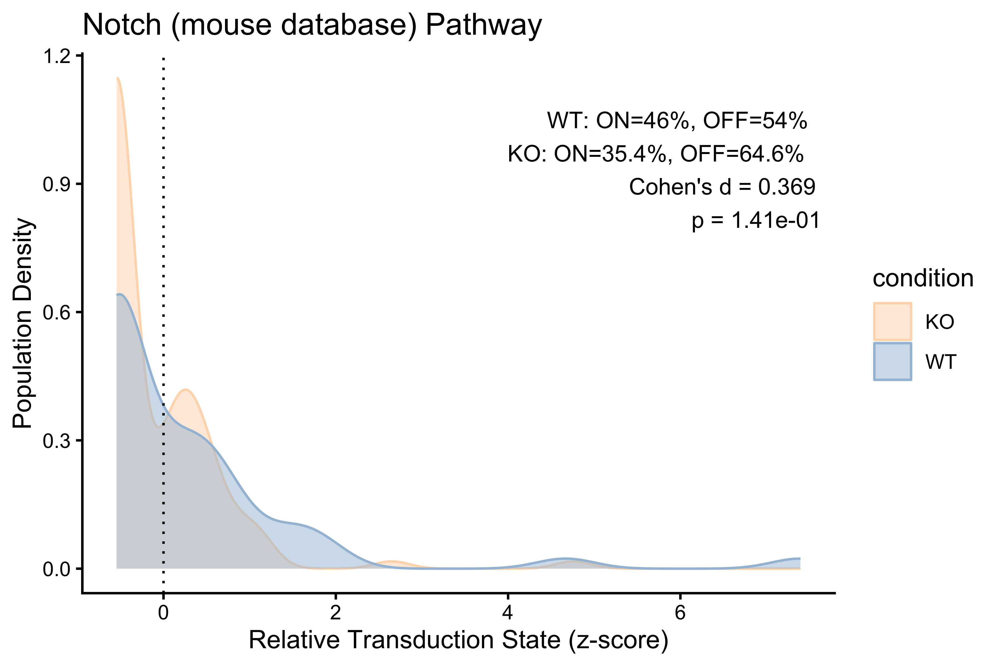

``` r

PlotPathway(to_plot_2, "Notch (human 24hr database)", "condition",
            c("#FFDAB9", "#A3BFD9")) +
  annotate("text", x = Inf, y = Inf, hjust = 1.1, vjust = 1.5,
           label = make_label(pct_2, "WT", "KO"), size = 3.5, color = "black")
```

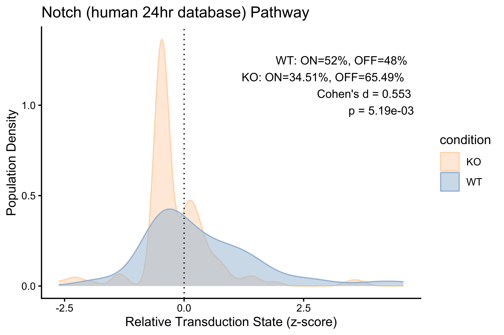

------------------------------------------------------------------------

## Benchmark — Ncstn KO vs. WT

``` r
common_genes         <- intersect(rownames(COI_2_matrix), pathwaydata_24hr$Gene_Symbol)
gene_matrix          <- as.matrix(COI_2_matrix[common_genes, ])
mean_expr            <- colMeans(gene_matrix, na.rm = TRUE)
zscore_mean_per_cell <- colMeans(t(scale(t(gene_matrix))), na.rm = TRUE)

Notch_features <- rownames(matrix_24hr)
COI_2 <- AddModuleScore(
  object   = COI_2,
  features = list(Notch_features),
  name     = "Notch_ModuleScore",
  ctrl     = 5,
  nbin     = 10
)
module_score <- setNames(
  COI_2@meta.data$Notch_ModuleScore1,
  rownames(COI_2@meta.data)
)

cells <- names(Notch_score_24hr)
benchmark_df <- data.frame(
  PathwayEmbed   = as.numeric(Notch_score_24hr),
  AddModuleScore = as.numeric(module_score[cells]),
  mean_expr      = as.numeric(mean_expr[cells]),
  zscore_expr    = as.numeric(zscore_mean_per_cell[cells]),
  row.names      = cells
)

benchmark_cor <- cor(benchmark_df, method = "spearman",
                     use = "pairwise.complete.obs")
print(round(benchmark_cor, 3))
#>                PathwayEmbed AddModuleScore mean_expr zscore_expr
#> PathwayEmbed          1.000          0.645     0.730       0.690
#> AddModuleScore        0.645          1.000     0.899       0.848
#> mean_expr             0.730          0.899     1.000       0.954
#> zscore_expr           0.690          0.848     0.954       1.000

p_cor <- pheatmap(
  benchmark_cor,
  color           = colorRampPalette(c("#185FA5", "white", "#993C1D"))(100),
  breaks          = seq(-1, 1, length.out = 101),
  display_numbers = TRUE, number_format = "%.2f",
  fontsize_number = 9,
  main            = "Method Benchmark — Spearman Correlation (Ncstn KO dataset)"
)
p_cor
```

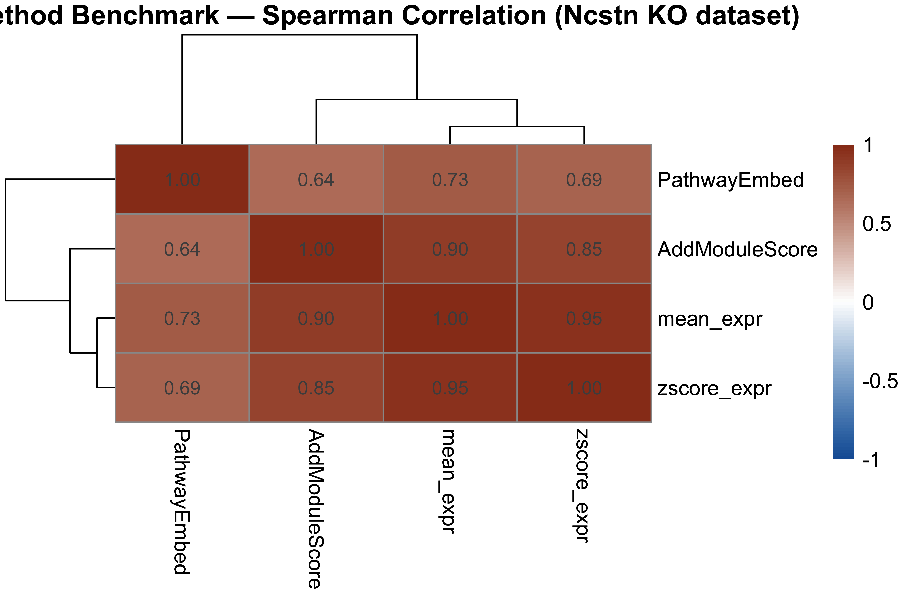

``` r

ko_label <- ifelse(COI_2@meta.data[cells, "condition"] == "KO", 1L, 0L)

compute_auroc <- function(scores, labels) {
  r       <- roc(labels, scores, quiet = TRUE)
  auc_val <- as.numeric(auc(r))
  if (auc_val < 0.5) auc_val <- 1 - auc_val
  auc_val
}

auroc_results <- data.frame(
  Method = colnames(benchmark_df),
  AUROC  = sapply(benchmark_df, compute_auroc, labels = ko_label)
)
auroc_results <- auroc_results[order(-auroc_results$AUROC), ]
print(auroc_results)
#>                        Method     AUROC
#> PathwayEmbed     PathwayEmbed 0.6288496
#> mean_expr           mean_expr 0.6224779
#> zscore_expr       zscore_expr 0.6175221
#> AddModuleScore AddModuleScore 0.5929204

compute_cohens_d_method <- function(scores_vec, seurat_obj, group_col) {
  pd  <- PreparePlotData(seurat_obj, scores_vec, group_col, Seurat.object = TRUE)
  pct <- CalculatePercentage(pd, group_var = group_col)
  abs(pct$cohens_d[1])
}

cohens_d_results <- data.frame(
  Method   = colnames(benchmark_df),
  Cohens_d = sapply(
    colnames(benchmark_df),
    function(m) {
      sv <- setNames(benchmark_df[[m]], rownames(benchmark_df))
      compute_cohens_d_method(sv, COI_2, "condition")
    }
  )
)
cohens_d_results <- cohens_d_results[order(-cohens_d_results$Cohens_d), ]
print(cohens_d_results)
#>                        Method  Cohens_d
#> mean_expr           mean_expr 0.5751355
#> PathwayEmbed     PathwayEmbed 0.5534599
#> zscore_expr       zscore_expr 0.5397190
#> AddModuleScore AddModuleScore 0.4965140

method_colors <- c(
  "PathwayEmbed"   = "#534AB7",
  "zscore_expr"    = "#E24B4A",
  "AddModuleScore" = "#EF9F27",
  "mean_expr"      = "#888780"
)

p_cd <- ggplot(cohens_d_results,
       aes(x = reorder(Method, Cohens_d), y = Cohens_d, fill = Method)) +
  geom_bar(stat = "identity", width = 0.6) +
  coord_flip() +
  scale_fill_manual(values = method_colors) +
  labs(title = "Effect size (Cohen's d): KO vs. WT",
       x = NULL, y = "Cohen's d (absolute)") +
  theme_classic() +
  theme(legend.position = "none")
p_cd
```

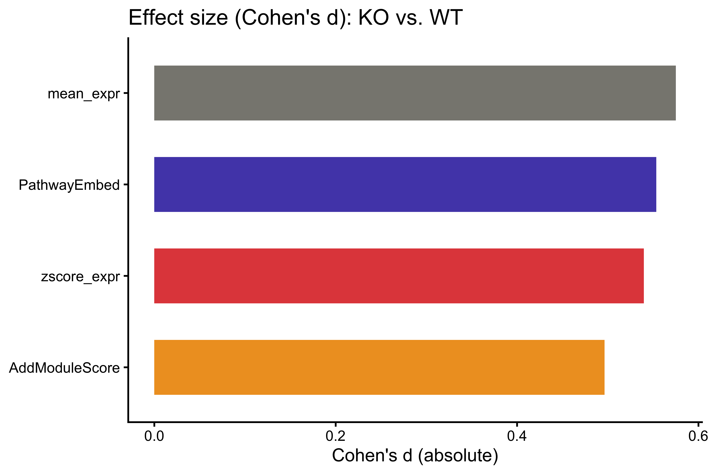

``` r

p_auroc <- ggplot(auroc_results,
       aes(x = reorder(Method, AUROC), y = AUROC, fill = Method)) +
  geom_bar(stat = "identity", width = 0.6) +
  geom_hline(yintercept = 0.5, linetype = "dashed", color = "black") +
  coord_flip() +
  scale_fill_manual(values = method_colors) +
  labs(title = "AUROC: KO vs. WT separation (Ncstn KO dataset)",
       x = NULL, y = "AUROC") +
  ylim(0, 1) +
  theme_classic() +
  theme(legend.position = "none")
p_auroc
```

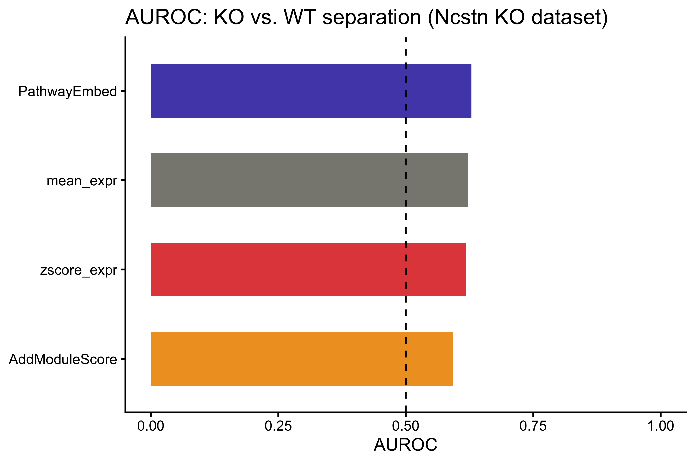

``` r

roc_list <- lapply(colnames(benchmark_df), function(m) {
  roc(ko_label, benchmark_df[[m]], quiet = TRUE)
})
names(roc_list) <- colnames(benchmark_df)

roc_df <- do.call(rbind, lapply(names(roc_list), function(m) {
  r <- roc_list[[m]]
  data.frame(Method = m, FPR = 1 - r$specificities, TPR = r$sensitivities)
}))

p_roc <- ggplot(roc_df, aes(x = FPR, y = TPR, color = Method)) +
  geom_line(linewidth = 0.9) +
  geom_abline(intercept = 0, slope = 1, linetype = "dashed", color = "grey60") +
  scale_color_manual(values = method_colors) +
  labs(title = "ROC curves: KO vs. WT (Ncstn KO dataset)",
       x = "False positive rate", y = "True positive rate") +
  theme_classic()
p_roc
```

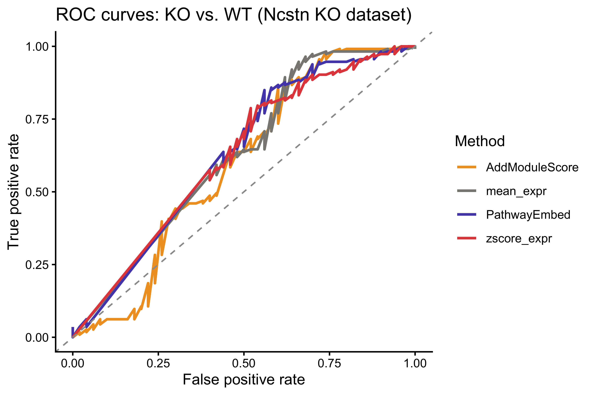

------------------------------------------------------------------------

## Data Preprocessing — Middle-Age vs. Young SSPCs

``` r
wt_data    <- Read10X("path/to/WT",    gene.column = 2)
young_data <- Read10X("path/to/Young", gene.column = 2)

WT_object    <- CreateSeuratObject(counts = wt_data)
Young_object <- CreateSeuratObject(counts = young_data)
WT_object$Age    <- "MiddleAge"
Young_object$Age <- "Young"

WT_object[["percent.mt"]]    <- PercentageFeatureSet(WT_object,    pattern = "^mt-")
Young_object[["percent.mt"]] <- PercentageFeatureSet(Young_object, pattern = "^mt-")

# NOTE: 30% threshold is intentionally permissive — skeletal stem cells retain
# higher baseline mitochondrial content; tighter thresholds remove genuine SSPCs.
WT_object_filtered    <- subset(WT_object,    subset = nFeature_RNA >= 100 & percent.mt < 30)
Young_object_filtered <- subset(Young_object, subset = nFeature_RNA >= 100 & percent.mt < 30)

merge_object          <- merge(WT_object_filtered, Young_object_filtered,
                                add.cell.ids = c("WT", "Young"))
merge_object[["RNA"]] <- JoinLayers(merge_object[["RNA"]])

merge_object <- NormalizeData(merge_object)
merge_object <- subset(
  merge_object,
  features = rownames(merge_object)[
    Matrix::rowSums(GetAssayData(merge_object, slot = "counts") > 0) > 5]
)
merge_object <- FindVariableFeatures(merge_object, selection.method = "vst",
                                      nfeatures = 3000)
merge_object <- ScaleData(merge_object)
merge_object <- RunPCA(merge_object)
ElbowPlot(merge_object)
merge_object <- FindNeighbors(merge_object, dims = 1:10)
merge_object <- FindClusters(merge_object, resolution = 1)
merge_object <- RunUMAP(merge_object, dims = 1:10)

DimPlot(merge_object, reduction = "umap", group.by = "Age", label = TRUE)
FeaturePlot(merge_object, reduction = "umap", features = "Cxcl12", order = TRUE)

cluster_of_interest <- subset(merge_object, subset = seurat_clusters == 11)
saveRDS(cluster_of_interest, file = "Middle_age_object.rds")
```

------------------------------------------------------------------------

## Notch Signaling in Middle-Age vs. Young SSPCs

``` r
# Re-use the human 24hr database loaded earlier
matrix_notch      <- DataPreProcess(cluster_of_interest, pathwaydata_24hr,
                                     Seurat.object = TRUE)
pathwaystat_notch <- PathwayMaxMin(matrix_notch, pathwaydata_24hr)
Notch_score       <- ComputeCellData(matrix_notch, pathwaystat_notch)

to_plot   <- PreparePlotData(cluster_of_interest, Notch_score, "Age",
                              Seurat.object = TRUE)
age_stats <- CalculatePercentage(to_plot, "Age")
age_stats
#> # A tibble: 2 × 5
#>   group     percentage_on percentage_off cohens_d    p_value
#>   <chr>             <dbl>          <dbl>    <dbl>      <dbl>
#> 1 MiddleAge          55.8           44.2    0.605 0.00000455
#> 2 Young              26.1           73.9    0.605 0.00000455

PlotPathway(to_plot, "Notch", "Age", c("orange", "#6baed6")) +
  annotate("text", x = Inf, y = Inf, hjust = 1.1, vjust = 1.5,
           label = make_label(age_stats, "MiddleAge", "Young"),
           size = 3.5, color = "black")
```

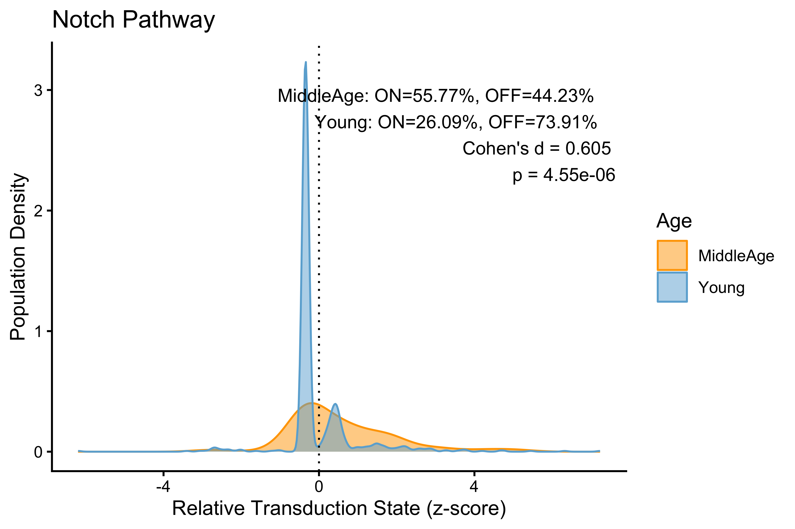

------------------------------------------------------------------------

## Multi-Pathway Analysis — Middle-Age vs. Young SSPCs

``` r
HIf1a_pathwaydata <- LoadPathway("Hypoxia_24hr",          "mouse")
Hippo_pathwaydata <- LoadPathway("HIPPO_heat",             "mouse")
TGFb_pathwaydata  <- LoadPathway("TGFB_Mouse",             "mouse")
Wnt_pathwaydata   <- LoadPathway("WNT3A_SLOPE_ACTIVATION", "mouse")

pathway_list <- list(
  HIF1a = HIf1a_pathwaydata,
  Hippo = Hippo_pathwaydata,
  TGFb  = TGFb_pathwaydata,
  Wnt   = Wnt_pathwaydata
)

score_list    <- list()
cohens_d_list <- list()

for (pathway_name in names(pathway_list)) {
  pathway_data <- pathway_list[[pathway_name]]
  matrix_data  <- DataPreProcess(cluster_of_interest, pathway_data,
                                  Seurat.object = TRUE)
  pathway_stat <- PathwayMaxMin(matrix_data, pathway_data)
  score        <- ComputeCellData(matrix_data, pathway_stat)
  score_list[[pathway_name]] <- score

  to_plot_p   <- PreparePlotData(cluster_of_interest, score, "Age",
                                  Seurat.object = TRUE)
  age_stats_p <- CalculatePercentage(to_plot_p, "Age")
  cohens_d_list[[pathway_name]] <- abs(age_stats_p$cohens_d[1])

  p <- PlotPathway(to_plot_p, pathway_name, "Age", c("orange", "#6baed6")) +
    annotate("text", x = Inf, y = Inf, hjust = 1.1, vjust = 1.5,
             label = make_label(age_stats_p, "MiddleAge", "Young"),
             size = 3.5, color = "black")

  print(p)
  ggsave(
    filename = paste0("figs/", gsub("[^A-Za-z0-9_]", "_", pathway_name), "_age.png"),
    plot     = p, width = 5, height = 4, dpi = 300
  )
}
```

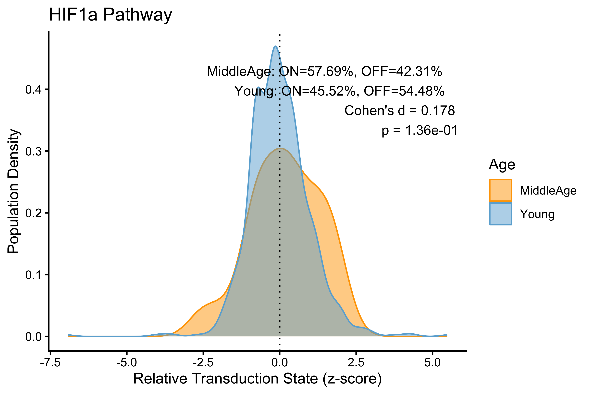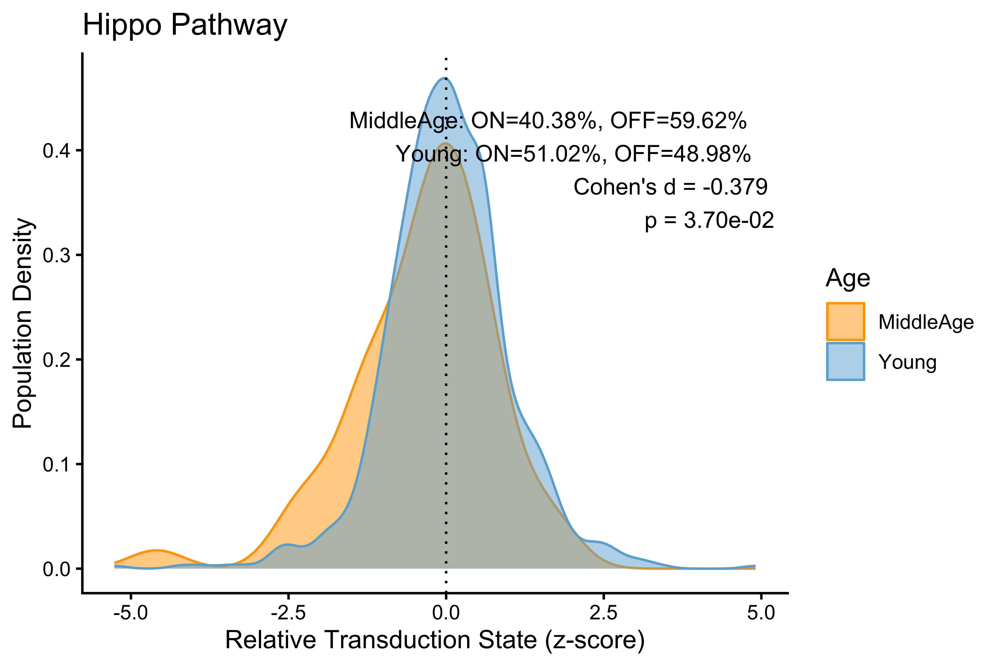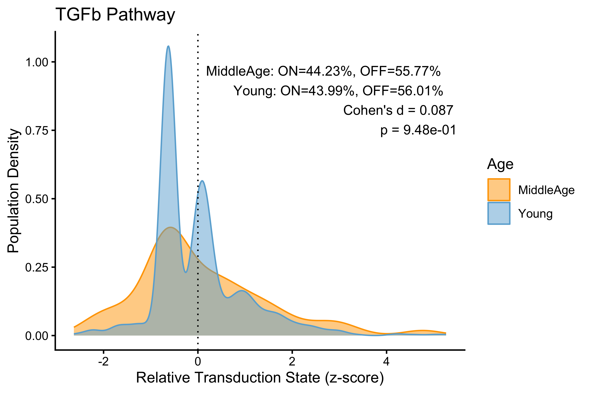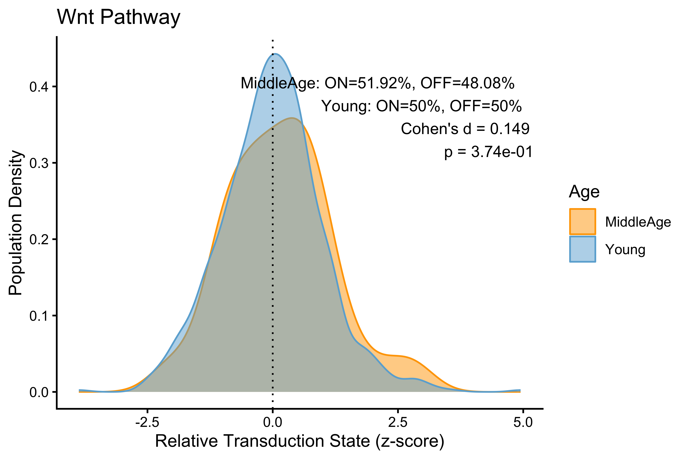

------------------------------------------------------------------------

## Cross-Pathway Comparison

``` r
# Add Notch to score list (computed in notch-aging chunk)
score_list[["Notch"]] <- Notch_score
cohens_d_list[["Notch"]] <- abs(age_stats$cohens_d[1])

# Build score data frame aligned to metadata
score_df      <- as.data.frame(score_list)
score_df$cell <- rownames(score_df)

meta_df      <- cluster_of_interest@meta.data
meta_df$cell <- rownames(meta_df)

score_df$Age        <- meta_df$Age[match(score_df$cell, meta_df$cell)]
score_df$Age_binary <- ifelse(score_df$Age == "MiddleAge", 1, 0)

pathway_cols <- c("HIF1a", "Hippo", "TGFb", "Wnt", "Notch")
pathway_mat  <- score_df[, pathway_cols]

# Spearman correlation heatmap
pathway_cor <- cor(pathway_mat, method = "spearman", use = "pairwise.complete.obs")
print(round(pathway_cor, 3))
#>        HIF1a  Hippo   TGFb    Wnt  Notch
#> HIF1a  1.000 -0.016  0.097  0.039  0.118
#> Hippo -0.016  1.000 -0.025 -0.097 -0.042
#> TGFb   0.097 -0.025  1.000  0.020  0.050
#> Wnt    0.039 -0.097  0.020  1.000  0.080
#> Notch  0.118 -0.042  0.050  0.080  1.000

pheatmap(
  pathway_cor,
  color           = colorRampPalette(c("#185FA5", "white", "#993C1D"))(100),
  breaks          = seq(-1, 1, length.out = 101),
  display_numbers = TRUE, number_format = "%.2f",
  fontsize_number = 10,
  main            = "Spearman Correlation Between Pathways"
)
```

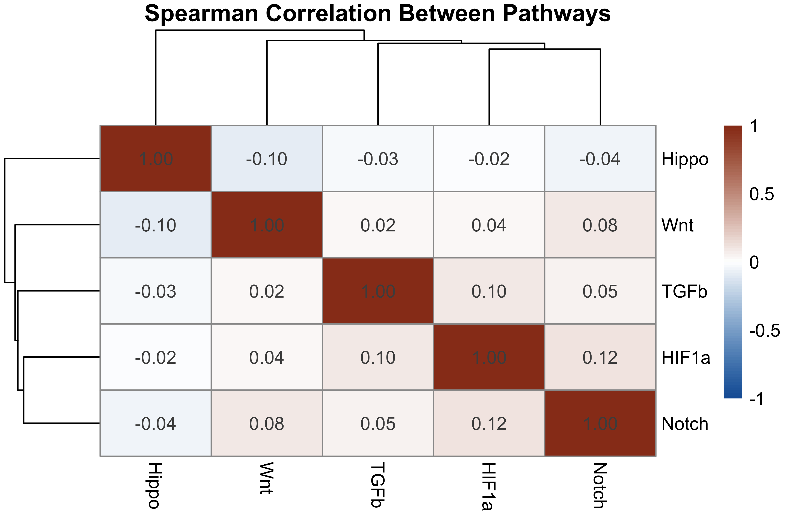

``` r

# PCA of pathway activity space
pca   <- prcomp(pathway_mat, scale. = TRUE)
p_pca <- data.frame(pca$x, Age = score_df$Age)

ggplot(p_pca, aes(PC1, PC2, color = Age)) +
  geom_point(alpha = 0.6) +
  theme_classic() +
  labs(title = "PCA of pathway activity space")
```

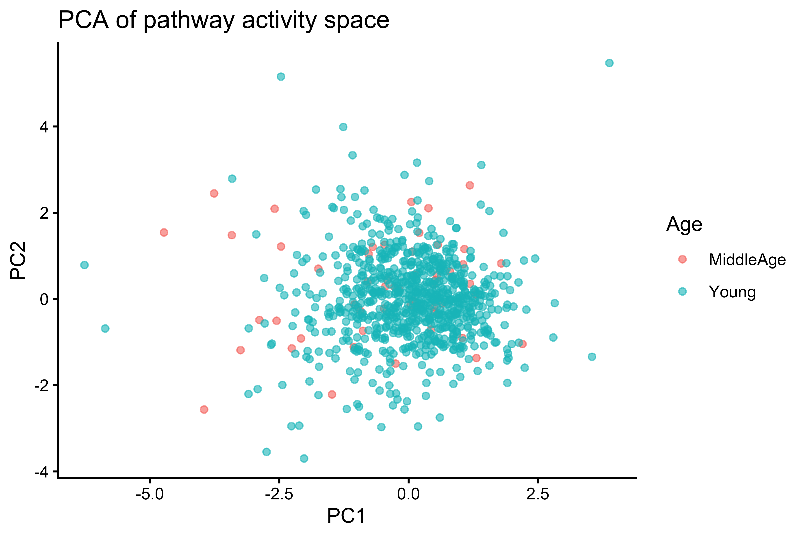

``` r

# AUROC per pathway
compute_auroc_safe <- function(scores, labels) {
  valid  <- !is.na(scores) & !is.na(labels)
  if (length(unique(labels[valid])) < 2) return(NA)
  r <- roc(labels[valid], scores[valid], quiet = TRUE)
  a <- as.numeric(auc(r))
  if (a < 0.5) a <- 1 - a
  a
}

auroc_df <- data.frame(
  Pathway = pathway_cols,
  AUROC   = sapply(pathway_cols, function(pw) {
    compute_auroc_safe(score_df[[pw]], score_df$Age_binary)
  })
)
auroc_df <- auroc_df[order(-auroc_df$AUROC), ]
print(auroc_df)
#>       Pathway     AUROC
#> Notch   Notch 0.6560963
#> Hippo   Hippo 0.5862802
#> HIF1a   HIF1a 0.5615532
#> Wnt       Wnt 0.5368016
#> TGFb     TGFb 0.5026313

p_auroc_age <- ggplot(auroc_df,
       aes(x = reorder(Pathway, AUROC), y = AUROC, fill = Pathway)) +
  geom_col(width = 0.6) +
  coord_flip() +
  geom_hline(yintercept = 0.5, linetype = "dashed") +
  geom_text(aes(label = sprintf("%.2f", AUROC)), hjust = -0.1, size = 3) +
  ylim(0, 1.05) +
  labs(title = "AUROC comparison across pathways", x = NULL, y = "AUROC") +
  theme_classic() +
  theme(legend.position = "none")
p_auroc_age
```

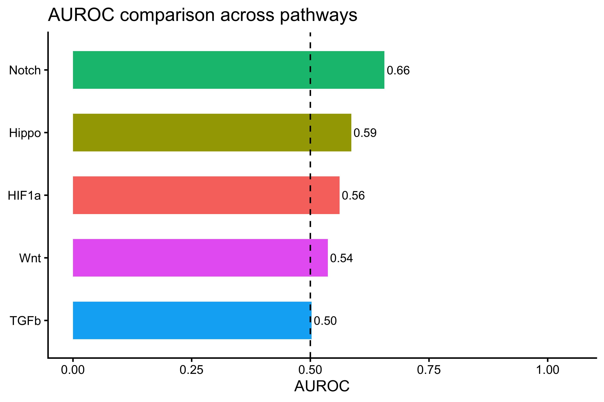

``` r

# Cohen's d per pathway
cohens_d_df <- data.frame(
  Pathway  = names(cohens_d_list),
  Cohens_d = unlist(cohens_d_list)
)
cohens_d_df <- cohens_d_df[order(-cohens_d_df$Cohens_d), ]
print(cohens_d_df)
#>       Pathway   Cohens_d
#> Notch   Notch 0.60484360
#> Hippo   Hippo 0.37912152
#> HIF1a   HIF1a 0.17792267
#> Wnt       Wnt 0.14897250
#> TGFb     TGFb 0.08659418

p_cd <- ggplot(cohens_d_df,
       aes(x = reorder(Pathway, Cohens_d), y = Cohens_d, fill = Pathway)) +
  geom_col(width = 0.6) +
  coord_flip() +
  geom_text(aes(label = sprintf("%.2f", Cohens_d)), hjust = -0.1, size = 3) +
  ylim(0, max(cohens_d_df$Cohens_d) * 1.1) +
  labs(title = "Effect size (Cohen's d) across pathways", x = NULL, y = "Cohen's d (absolute)") +
  theme_classic() +
  theme(legend.position = "none")
p_cd
```

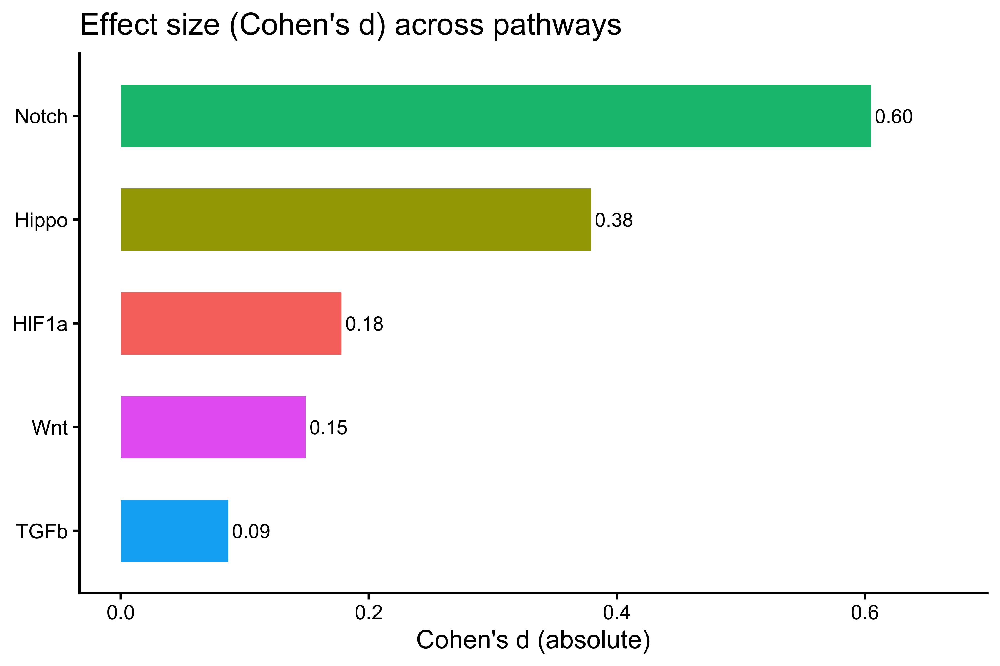

------------------------------------------------------------------------

## Technical Confounders

``` r
cc_genes  <- Seurat::cc.genes.updated.2019
cluster_of_interest <- CellCycleScoring(
  cluster_of_interest,
  s.features   = cc_genes$s.genes,
  g2m.features = cc_genes$g2m.genes,
  set.ident    = FALSE
)

stress_genes <- c(
  "Fos", "Jun", "Junb", "Atf3", "Egr1",
  "Ddit3", "Atf4", "Xbp1", "Hspa5",
  "Hspa1a", "Hspa1b", "Hsp90aa1",
  "Gadd45a", "Gadd45b", "Gadd45g"
)
cluster_of_interest <- AddModuleScore(
  cluster_of_interest,
  features = list(stress_genes),
  name     = "StressScore",
  ctrl     = 25,
  nbin     = 24
)

meta_cc <- cluster_of_interest@meta.data

# Merge scores with metadata
score_df_full <- score_df
score_df_full$S_score   <- meta_cc$S.Score[  match(score_df_full$cell, rownames(meta_cc))]
score_df_full$G2M_score <- meta_cc$G2M.Score[match(score_df_full$cell, rownames(meta_cc))]
score_df_full$Stress    <- cluster_of_interest$StressScore1[
                             match(score_df_full$cell, rownames(meta_cc))]
score_df_full$nCount_RNA   <- meta_cc$nCount_RNA[  match(score_df_full$cell, rownames(meta_cc))]
score_df_full$nFeature_RNA <- meta_cc$nFeature_RNA[match(score_df_full$cell, rownames(meta_cc))]
score_df_full$percent.mt   <- meta_cc$percent.mt[  match(score_df_full$cell, rownames(meta_cc))]

covariates <- c("nCount_RNA", "nFeature_RNA", "percent.mt",
                "Stress", "S_score", "G2M_score")

cor_mat <- sapply(covariates, function(cov) {
  sapply(pathway_cols, function(pw) {
    cor(score_df_full[[pw]], score_df_full[[cov]],
        method = "spearman", use = "complete.obs")
  })
})
rownames(cor_mat) <- pathway_cols
colnames(cor_mat) <- covariates
print(round(cor_mat, 3))
#>       nCount_RNA nFeature_RNA percent.mt Stress S_score G2M_score
#> HIF1a      0.315        0.286     -0.148  0.190  -0.031    -0.018
#> Hippo     -0.140       -0.140     -0.048  0.028   0.051     0.055
#> TGFb       0.149        0.152     -0.017  0.002   0.016    -0.002
#> Wnt        0.116        0.136     -0.004  0.051  -0.003     0.001
#> Notch      0.181        0.204      0.019  0.161  -0.057    -0.062

pheatmap(cor_mat,
         color           = colorRampPalette(c("#185FA5", "white", "#993C1D"))(100),
         breaks          = seq(-1, 1, length.out = 101),
         display_numbers = TRUE, number_format = "%.2f",
         fontsize_number = 10,
         main            = "Pathway vs. covariate correlations (Spearman)")
```

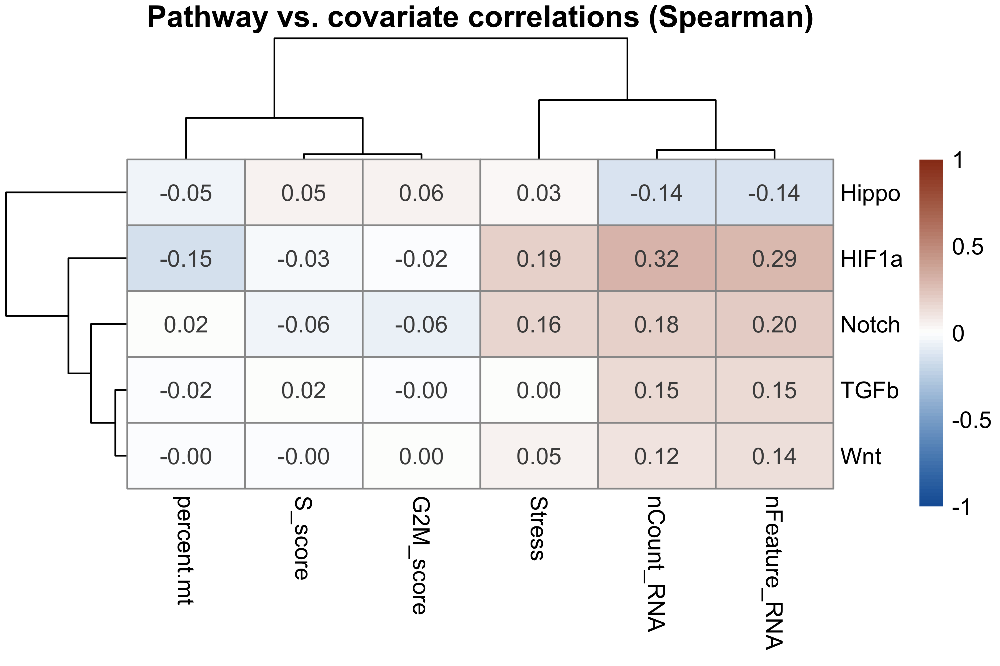

``` r

# Scatter: each pathway vs. stress score
plot_df_long <- pivot_longer(
  score_df_full[, c("Stress", pathway_cols)],
  cols      = all_of(pathway_cols),
  names_to  = "Pathway",
  values_to = "Score"
)

cor_df_stress <- plot_df_long %>%
  group_by(Pathway) %>%
  summarise(cor = cor(Stress, Score, method = "spearman", use = "complete.obs"),
            .groups = "drop")

ggplot(plot_df_long, aes(x = Stress, y = Score)) +
  geom_point(alpha = 0.4, size = 1.2) +
  geom_smooth(method = "lm", se = FALSE, linetype = "dashed", color = "#E24B4A") +
  facet_wrap(~ Pathway, scales = "free_y") +
  geom_text(data = cor_df_stress,
            aes(x = Inf, y = Inf,
                label = paste0("\u03c1 = ", round(cor, 2))),
            hjust = 1.2, vjust = 1.5, inherit.aes = FALSE) +
  theme_classic() +
  labs(title = "Pathway scores vs. stress score (Spearman)",
       x = "Stress score", y = "Pathway score")
```

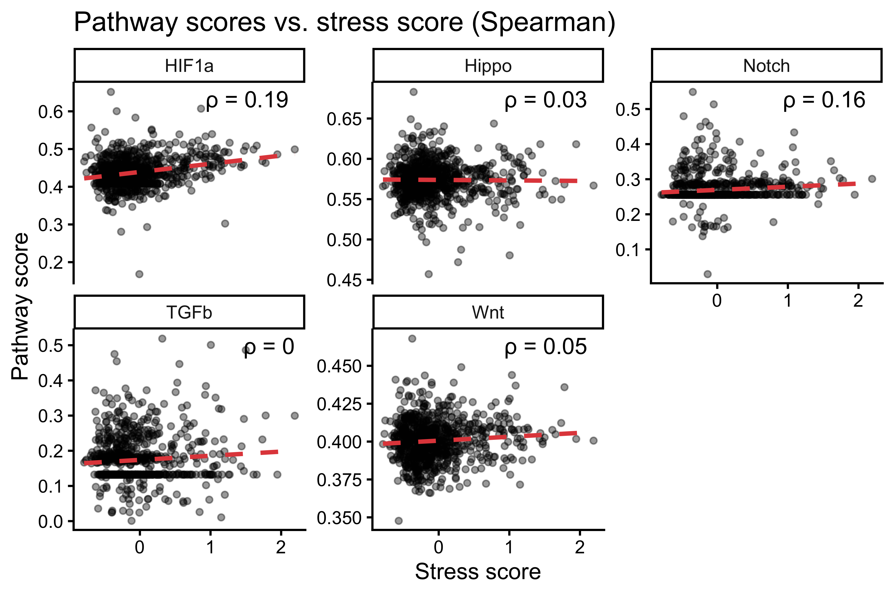
