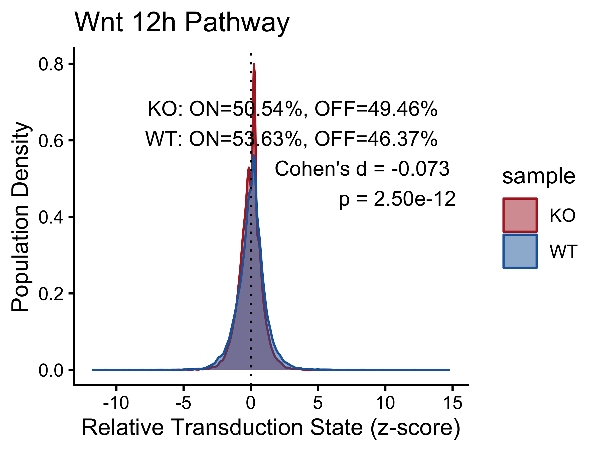
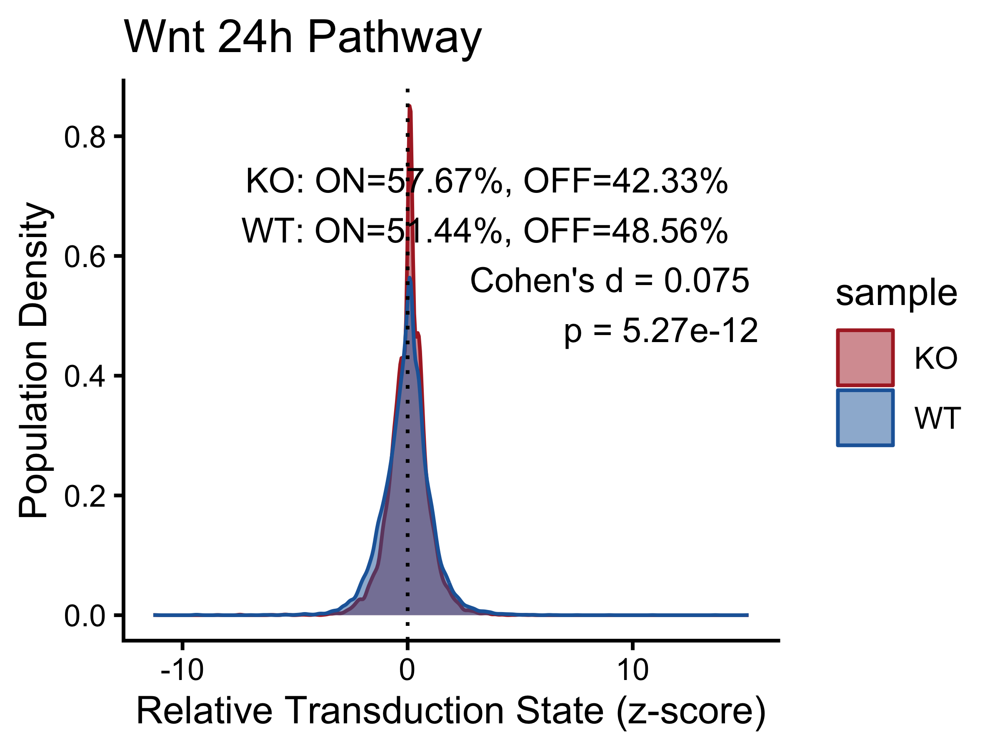
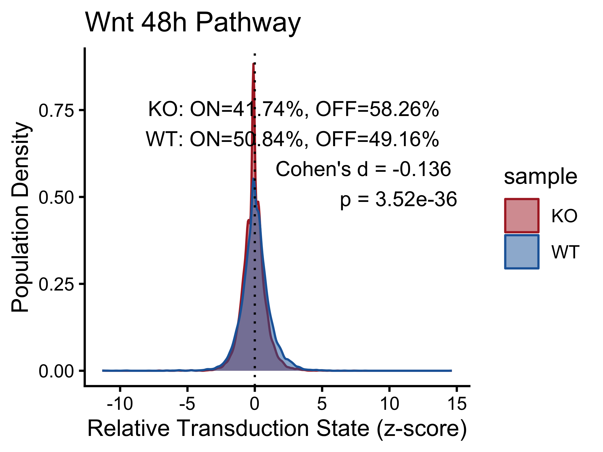
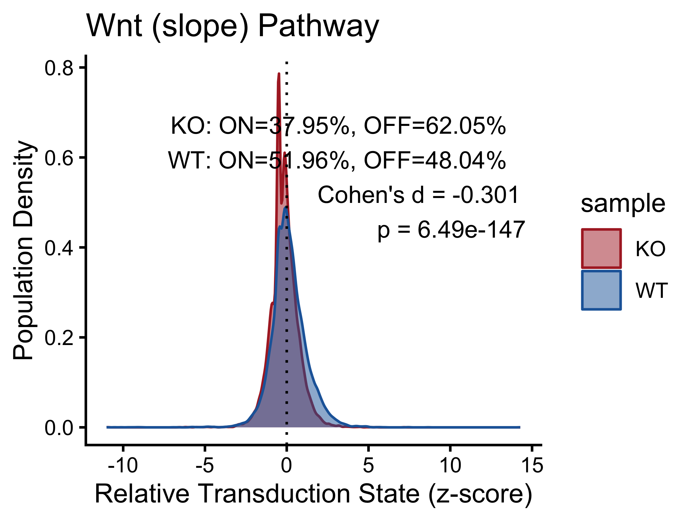
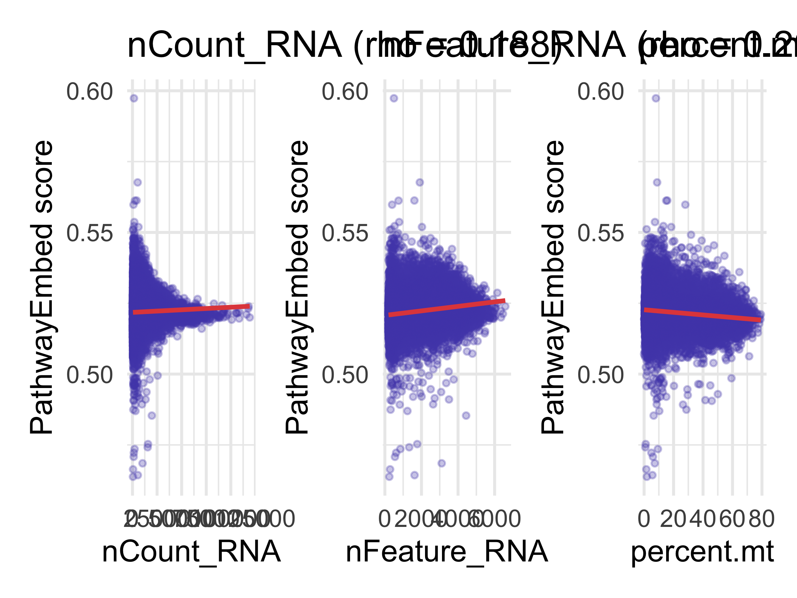
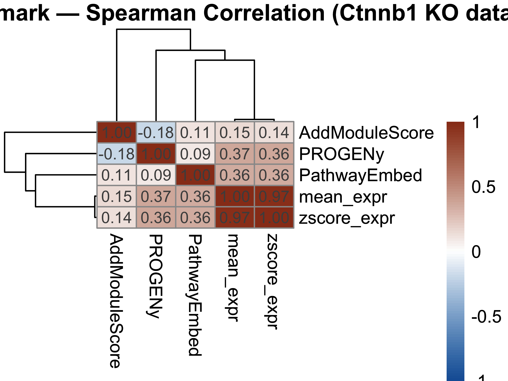
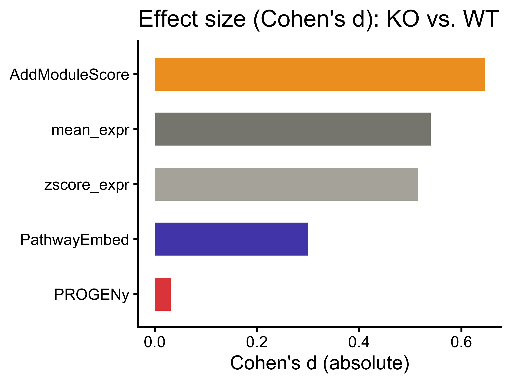
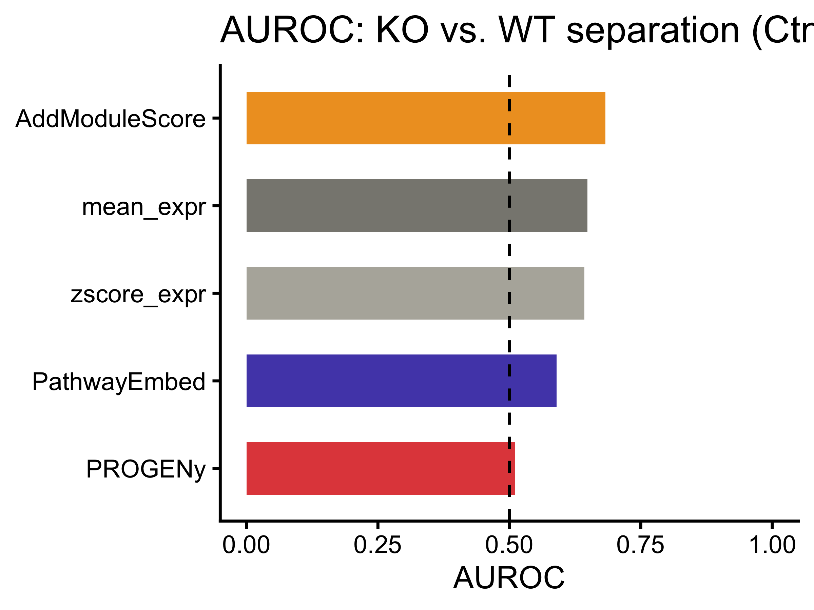
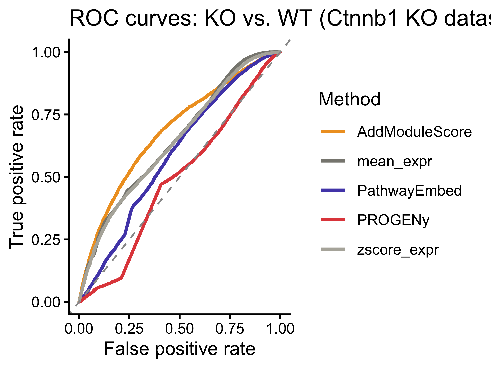

# Beta-Catenin Knockout Analysis with PathwayEmbed

## Overview

This vignette demonstrates the application of PathwayEmbed in a
beta-catenin perturbed system where the *Ctnnb1* upstream enhancer is
depleted in intestinal epithelia. Because the KO genotype is known by
design, this dataset provides a clean biological ground truth for a
direct AUROC benchmark against PROGENy and AddModuleScore.

Reference: Hua et al., *eLife* 13: RP98238 (2024).
<https://doi.org/10.7554/eLife.98238>

------------------------------------------------------------------------

## Load Packages

``` r
library(PathwayEmbed)
library(Seurat)
#> Warning: package 'Seurat' was built under R version 4.4.3
#> Loading required package: SeuratObject
#> Warning: package 'SeuratObject' was built under R version 4.4.3
#> Loading required package: sp
#> Warning: package 'sp' was built under R version 4.4.3
#> 
#> Attaching package: 'SeuratObject'
#> The following objects are masked from 'package:base':
#> 
#>     intersect, t
library(ggplot2)
#> Warning: package 'ggplot2' was built under R version 4.4.3
library(patchwork)
library(pheatmap)
library(progeny)
library(pROC)
#> Registered S3 method overwritten by 'pROC':
#>   method   from            
#>   plot.roc spatstat.explore
#> Type 'citation("pROC")' for a citation.
#> 
#> Attaching package: 'pROC'
#> The following objects are masked from 'package:stats':
#> 
#>     cov, smooth, var
```

------------------------------------------------------------------------

## Helper: Annotation Label Builder

``` r
make_label <- function(stats, group1, group2) {
  d    <- round(stats$cohens_d[1], 3)
  p    <- formatC(stats$p_value[1], format = "e", digits = 2)
  on1  <- stats$percentage_on[stats$group  == group1]
  off1 <- stats$percentage_off[stats$group == group1]
  on2  <- stats$percentage_on[stats$group  == group2]
  off2 <- stats$percentage_off[stats$group == group2]
  paste0(
    group1, ": ON=", on1,  "%, OFF=", off1, "%\n",
    group2, ": ON=", on2,  "%, OFF=", off2, "%\n",
    "Cohen's d = ", d, "\n",
    "p = ", p
  )
}
```

------------------------------------------------------------------------

## Download Data

``` r
url_ko <- "https://ftp.ncbi.nlm.nih.gov/geo/series/GSE233nnn/GSE233978/suppl/GSE233978_KO_filtered_feature_bc_matrix.h5"
url_wt <- "https://ftp.ncbi.nlm.nih.gov/geo/series/GSE233nnn/GSE233978/suppl/GSE233978_WT_filtered_feature_bc_matrix.h5"

download.file(url_ko, destfile = "GSE233978_KO_filtered_feature_bc_matrix.h5", mode = "wb")
download.file(url_wt, destfile = "GSE233978_WT_filtered_feature_bc_matrix.h5", mode = "wb")
```

------------------------------------------------------------------------

## Data Preparation and Preprocessing

``` r
ko_data <- Read10X_h5("GSE233978_KO_filtered_feature_bc_matrix.h5")
wt_data <- Read10X_h5("GSE233978_WT_filtered_feature_bc_matrix.h5")

ko <- CreateSeuratObject(counts = ko_data, project = "KO",
                          min.cells = 3, min.features = 200)
wt <- CreateSeuratObject(counts = wt_data, project = "WT",
                          min.cells = 3, min.features = 200)
ko$sample <- "KO"
wt$sample <- "WT"

merged          <- merge(ko, wt)
#> Warning: Some cell names are duplicated across objects provided. Renaming to
#> enforce unique cell names.
merged[["RNA"]] <- JoinLayers(merged[["RNA"]])

merged <- NormalizeData(merged, normalization.method = "LogNormalize",
                         scale.factor = 10000)
#> Normalizing layer: counts
merged <- FindVariableFeatures(merged, selection.method = "vst",
                                nfeatures = 2000)
#> Finding variable features for layer counts
merged <- ScaleData(merged, features = VariableFeatures(merged))
#> Centering and scaling data matrix
```

------------------------------------------------------------------------

## Wnt Pathway Scoring

``` r
Wnt_12h   <- LoadPathway("WNT3A_12H_ACTIVATION",  "mouse")
Wnt_24h   <- LoadPathway("WNT3A_24H_ACTIVATION",  "mouse")
Wnt_48h   <- LoadPathway("WNT3A_48H_ACTIVATION",  "mouse")
Wnt_slope <- LoadPathway("WNT3A_SLOPE_ACTIVATION", "mouse")

matrix_12h   <- DataPreProcess(merged, Wnt_12h,   Seurat.object = TRUE)
#> Warning in asMethod(object): sparse->dense coercion: allocating vector of size
#> 3.3 GiB
matrix_24h   <- DataPreProcess(merged, Wnt_24h,   Seurat.object = TRUE)
#> Warning in asMethod(object): sparse->dense coercion: allocating vector of size
#> 3.3 GiB
matrix_48h   <- DataPreProcess(merged, Wnt_48h,   Seurat.object = TRUE)
#> Warning in asMethod(object): sparse->dense coercion: allocating vector of size
#> 3.3 GiB
matrix_slope <- DataPreProcess(merged, Wnt_slope, Seurat.object = TRUE)
#> Warning in asMethod(object): sparse->dense coercion: allocating vector of size
#> 3.3 GiB

pathwaystat_12h   <- PathwayMaxMin(matrix_12h,   Wnt_12h)
pathwaystat_24h   <- PathwayMaxMin(matrix_24h,   Wnt_24h)
pathwaystat_48h   <- PathwayMaxMin(matrix_48h,   Wnt_48h)
pathwaystat_slope <- PathwayMaxMin(matrix_slope, Wnt_slope)

score_12h   <- ComputeCellData(matrix_12h,   pathwaystat_12h)
#> Computing distance...
score_24h   <- ComputeCellData(matrix_24h,   pathwaystat_24h)
#> Computing distance...
score_48h   <- ComputeCellData(matrix_48h,   pathwaystat_48h)
#> Computing distance...
score_slope <- ComputeCellData(matrix_slope, pathwaystat_slope)
#> Computing distance...
```

------------------------------------------------------------------------

## Visualization

``` r
plot_data_12h   <- PreparePlotData(merged, score_12h,   "sample", Seurat.object = TRUE)
plot_data_24h   <- PreparePlotData(merged, score_24h,   "sample", Seurat.object = TRUE)
plot_data_48h   <- PreparePlotData(merged, score_48h,   "sample", Seurat.object = TRUE)
plot_data_slope <- PreparePlotData(merged, score_slope, "sample", Seurat.object = TRUE)

pct_12h   <- CalculatePercentage(plot_data_12h,   "sample")
pct_24h   <- CalculatePercentage(plot_data_24h,   "sample")
pct_48h   <- CalculatePercentage(plot_data_48h,   "sample")
pct_slope <- CalculatePercentage(plot_data_slope, "sample")

pct_12h; pct_24h; pct_48h; pct_slope
#> # A tibble: 2 × 5
#>   group percentage_on percentage_off cohens_d  p_value
#>   <chr>         <dbl>          <dbl>    <dbl>    <dbl>
#> 1 KO             50.5           49.5  -0.0728 2.50e-12
#> 2 WT             53.6           46.4  -0.0728 2.50e-12
#> # A tibble: 2 × 5
#>   group percentage_on percentage_off cohens_d  p_value
#>   <chr>         <dbl>          <dbl>    <dbl>    <dbl>
#> 1 KO             57.7           42.3   0.0748 5.27e-12
#> 2 WT             51.4           48.6   0.0748 5.27e-12
#> # A tibble: 2 × 5
#>   group percentage_on percentage_off cohens_d  p_value
#>   <chr>         <dbl>          <dbl>    <dbl>    <dbl>
#> 1 KO             41.7           58.3   -0.136 3.52e-36
#> 2 WT             50.8           49.2   -0.136 3.52e-36
#> # A tibble: 2 × 5
#>   group percentage_on percentage_off cohens_d   p_value
#>   <chr>         <dbl>          <dbl>    <dbl>     <dbl>
#> 1 KO             38.0           62.0   -0.301 6.49e-147
#> 2 WT             52.0           48.0   -0.301 6.49e-147

p_12h <- PlotPathway(plot_data_12h,   "Wnt 12h",    "sample", c("#ae282c", "#2066a8")) +
  annotate("text", x = Inf, y = Inf, hjust = 1.1, vjust = 1.5,
           label = make_label(pct_12h, "KO", "WT"), size = 3.5, color = "black")
#> Warning: Using `size` aesthetic for lines was deprecated in ggplot2 3.4.0.
#> ℹ Please use `linewidth` instead.
#> ℹ The deprecated feature was likely used in the PathwayEmbed package.
#>   Please report the issue to the authors.
#> This warning is displayed once per session.
#> Call `lifecycle::last_lifecycle_warnings()` to see where this warning was
#> generated.

p_24h <- PlotPathway(plot_data_24h,   "Wnt 24h",    "sample", c("#ae282c", "#2066a8")) +
  annotate("text", x = Inf, y = Inf, hjust = 1.1, vjust = 1.5,
           label = make_label(pct_24h, "KO", "WT"), size = 3.5, color = "black")

p_48h <- PlotPathway(plot_data_48h,   "Wnt 48h",    "sample", c("#ae282c", "#2066a8")) +
  annotate("text", x = Inf, y = Inf, hjust = 1.1, vjust = 1.5,
           label = make_label(pct_48h, "KO", "WT"), size = 3.5, color = "black")

p_slope <- PlotPathway(plot_data_slope, "Wnt (slope)", "sample", c("#ae282c", "#2066a8")) +
  annotate("text", x = Inf, y = Inf, hjust = 1.1, vjust = 1.5,
           label = make_label(pct_slope, "KO", "WT"), size = 3.5, color = "black")

p_12h; p_24h; p_48h; p_slope
```



------------------------------------------------------------------------

## Technical Confounders

``` r
merged[["percent.mt"]] <- PercentageFeatureSet(merged, pattern = "^mt-")
seurat_meta <- merged@meta.data

make_scatter <- function(df, x_col, x_label) {
  r <- cor(df$embed_score, df[[x_col]], method = "spearman", use = "complete.obs")
  ggplot(df, aes(x = .data[[x_col]], y = embed_score)) +
    geom_point(alpha = 0.3, size = 0.8, color = "#534AB7") +
    geom_smooth(method = "lm", color = "#E24B4A", linewidth = 0.8, se = TRUE) +
    labs(title = sprintf("%s (rho = %.3f)", x_label, r),
         x = x_label, y = "PathwayEmbed score") +
    theme_minimal()
}

confounder_df <- data.frame(
  cell         = names(score_slope),
  embed_score  = as.numeric(score_slope),
  nCount_RNA   = seurat_meta[names(score_slope), "nCount_RNA"],
  nFeature_RNA = seurat_meta[names(score_slope), "nFeature_RNA"],
  percent_mt   = seurat_meta[names(score_slope), "percent.mt"]
)

for (cov in c("nCount_RNA", "nFeature_RNA", "percent_mt")) {
  r <- cor(confounder_df$embed_score, confounder_df[[cov]],
           method = "spearman", use = "complete.obs")
  cat(sprintf("Spearman vs %-15s : %.3f\n", cov, r))
}
#> Spearman vs nCount_RNA      : 0.188
#> Spearman vs nFeature_RNA    : 0.262
#> Spearman vs percent_mt      : -0.119

(make_scatter(confounder_df, "nCount_RNA",   "nCount_RNA") +
 make_scatter(confounder_df, "nFeature_RNA", "nFeature_RNA") +
 make_scatter(confounder_df, "percent_mt",   "percent.mt"))
#> `geom_smooth()` using formula = 'y ~ x'
#> `geom_smooth()` using formula = 'y ~ x'
#> `geom_smooth()` using formula = 'y ~ x'
```



------------------------------------------------------------------------

## Benchmark Against PROGENy and AddModuleScore

``` r
normalized_mat       <- GetAssayData(merged, assay = "RNA", layer = "data")
normalized_mat_dense <- as.matrix(normalized_mat)
#> Warning in asMethod(object): sparse->dense coercion: allocating vector of size
#> 3.3 GiB

common_genes         <- intersect(rownames(normalized_mat_dense), Wnt_slope$Gene_Symbol)
gene_matrix          <- normalized_mat_dense[common_genes, ]
mean_expr            <- colMeans(gene_matrix, na.rm = TRUE)
zscore_mean_per_cell <- colMeans(t(scale(t(gene_matrix))), na.rm = TRUE)

progeny_scores <- progeny(
  normalized_mat_dense,
  scale    = TRUE,
  organism = "Mouse",
  top      = 100,
  perm     = 1
)
progeny_wnt <- setNames(as.numeric(progeny_scores[, "WNT"]),
                         rownames(progeny_scores))

wnt_features <- rownames(matrix_slope)
merged <- AddModuleScore(
  object   = merged,
  features = list(wnt_features),
  name     = "WNT_ModuleScore",
  ctrl     = 5,
  nbin     = 10
)
module_score <- setNames(
  merged@meta.data$WNT_ModuleScore1,
  rownames(merged@meta.data)
)

cells <- names(score_slope)
benchmark_df <- data.frame(
  PathwayEmbed   = as.numeric(score_slope),
  PROGENy        = as.numeric(progeny_wnt[cells]),
  AddModuleScore = as.numeric(module_score[cells]),
  mean_expr      = as.numeric(mean_expr[cells]),
  zscore_expr    = as.numeric(zscore_mean_per_cell[cells]),
  row.names      = cells
)

benchmark_cor <- cor(benchmark_df, method = "spearman",
                     use = "pairwise.complete.obs")
print(round(benchmark_cor, 3))
#>                PathwayEmbed PROGENy AddModuleScore mean_expr zscore_expr
#> PathwayEmbed          1.000   0.095          0.106     0.359       0.356
#> PROGENy               0.095   1.000         -0.180     0.367       0.362
#> AddModuleScore        0.106  -0.180          1.000     0.146       0.139
#> mean_expr             0.359   0.367          0.146     1.000       0.972
#> zscore_expr           0.356   0.362          0.139     0.972       1.000

p_cor <- pheatmap(
  benchmark_cor,
  color           = colorRampPalette(c("#185FA5", "white", "#993C1D"))(100),
  breaks          = seq(-1, 1, length.out = 101),
  display_numbers = TRUE, number_format = "%.2f",
  fontsize_number = 9,
  main            = "Method Benchmark — Spearman Correlation (Ctnnb1 KO dataset)"
)
p_cor
```



``` r

ko_label <- ifelse(merged@meta.data[cells, "sample"] == "KO", 1L, 0L)

compute_auroc <- function(scores, labels) {
  r       <- roc(labels, scores, quiet = TRUE)
  auc_val <- as.numeric(auc(r))
  if (auc_val < 0.5) auc_val <- 1 - auc_val
  auc_val
}

auroc_results <- data.frame(
  Method = colnames(benchmark_df),
  AUROC  = sapply(benchmark_df, compute_auroc, labels = ko_label)
)
auroc_results <- auroc_results[order(-auroc_results$AUROC), ]
print(auroc_results)
#>                        Method     AUROC
#> AddModuleScore AddModuleScore 0.6827026
#> mean_expr           mean_expr 0.6482098
#> zscore_expr       zscore_expr 0.6425566
#> PathwayEmbed     PathwayEmbed 0.5897700
#> PROGENy               PROGENy 0.5106677

compute_cohens_d_method <- function(scores_vec, seurat_obj, group_col) {
  pd  <- PreparePlotData(seurat_obj, scores_vec, group_col, Seurat.object = TRUE)
  pct <- CalculatePercentage(pd, group_var = group_col)
  abs(pct$cohens_d[1])
}

cohens_d_results <- data.frame(
  Method   = colnames(benchmark_df),
  Cohens_d = sapply(
    colnames(benchmark_df),
    function(m) {
      sv <- setNames(benchmark_df[[m]], rownames(benchmark_df))
      compute_cohens_d_method(sv, merged, "sample")
    }
  )
)
cohens_d_results <- cohens_d_results[order(-cohens_d_results$Cohens_d), ]
print(cohens_d_results)
#>                        Method   Cohens_d
#> AddModuleScore AddModuleScore 0.64575350
#> mean_expr           mean_expr 0.54020251
#> zscore_expr       zscore_expr 0.51565732
#> PathwayEmbed     PathwayEmbed 0.30056596
#> PROGENy               PROGENy 0.03129493

method_colors <- c(
  "PathwayEmbed"   = "#534AB7",
  "PROGENy"        = "#E24B4A",
  "AddModuleScore" = "#EF9F27",
  "mean_expr"      = "#888780",
  "zscore_expr"    = "#B4B2A9"
)

p_cd <- ggplot(cohens_d_results,
       aes(x = reorder(Method, Cohens_d), y = Cohens_d, fill = Method)) +
  geom_bar(stat = "identity", width = 0.6) +
  coord_flip() +
  scale_fill_manual(values = method_colors) +
  labs(title = "Effect size (Cohen's d): KO vs. WT",
       x = NULL, y = "Cohen's d (absolute)") +
  theme_classic() +
  theme(legend.position = "none")
p_cd
```



``` r

p_auroc <- ggplot(auroc_results,
       aes(x = reorder(Method, AUROC), y = AUROC, fill = Method)) +
  geom_bar(stat = "identity", width = 0.6) +
  geom_hline(yintercept = 0.5, linetype = "dashed", color = "black") +
  coord_flip() +
  scale_fill_manual(values = method_colors) +
  labs(title = "AUROC: KO vs. WT separation (Ctnnb1 KO dataset)",
       x = NULL, y = "AUROC") +
  ylim(0, 1) +
  theme_classic() +
  theme(legend.position = "none")
p_auroc
```



``` r

roc_list <- lapply(colnames(benchmark_df), function(m) {
  roc(ko_label, benchmark_df[[m]], quiet = TRUE)
})
names(roc_list) <- colnames(benchmark_df)

roc_df <- do.call(rbind, lapply(names(roc_list), function(m) {
  r <- roc_list[[m]]
  data.frame(Method = m, FPR = 1 - r$specificities, TPR = r$sensitivities)
}))

p_roc <- ggplot(roc_df, aes(x = FPR, y = TPR, color = Method)) +
  geom_line(linewidth = 0.9) +
  geom_abline(intercept = 0, slope = 1, linetype = "dashed", color = "grey60") +
  scale_color_manual(values = method_colors) +
  labs(title = "ROC curves: KO vs. WT (Ctnnb1 KO dataset)",
       x = "False positive rate", y = "True positive rate") +
  theme_classic()
p_roc
```


