# Toy Set

## Overview

This vignette demonstrates how to use the PathwayEmbed package to
compute and visualize pathway activation using single-cell
transcriptomic data. We use the example dataset
`synthetic_test_object_100` included with the package.

------------------------------------------------------------------------

## Load Packages and Data

``` r
library(PathwayEmbed)
library(Seurat)
#> Warning: package 'Seurat' was built under R version 4.4.3
#> Loading required package: SeuratObject
#> Warning: package 'SeuratObject' was built under R version 4.4.3
#> Loading required package: sp
#> Warning: package 'sp' was built under R version 4.4.3
#> 
#> Attaching package: 'SeuratObject'
#> The following objects are masked from 'package:base':
#> 
#>     intersect, t
library(dplyr)
#> Warning: package 'dplyr' was built under R version 4.4.3
#> 
#> Attaching package: 'dplyr'
#> The following objects are masked from 'package:stats':
#> 
#>     filter, lag
#> The following objects are masked from 'package:base':
#> 
#>     intersect, setdiff, setequal, union
library(tidyr)
#> Warning: package 'tidyr' was built under R version 4.4.3
library(ggplot2)
#> Warning: package 'ggplot2' was built under R version 4.4.3
library(ggridges)
library(patchwork)
library(pheatmap)
library(progeny)
library(pROC)
#> Registered S3 method overwritten by 'pROC':
#>   method   from            
#>   plot.roc spatstat.explore
#> Type 'citation("pROC")' for a citation.
#> 
#> Attaching package: 'pROC'
#> The following objects are masked from 'package:stats':
#> 
#>     cov, smooth, var

data("synthetic_test_object_100")
data("synthetic_test_metadata")
```

------------------------------------------------------------------------

## Helper: Annotation Label Builder

``` r
make_label <- function(stats, group1, group2) {
  d    <- round(stats$cohens_d[1], 3)
  p    <- formatC(stats$p_value[1], format = "e", digits = 2)
  on1  <- stats$percentage_on[stats$group  == group1]
  off1 <- stats$percentage_off[stats$group == group1]
  on2  <- stats$percentage_on[stats$group  == group2]
  off2 <- stats$percentage_off[stats$group == group2]
  paste0(
    group1, ": ON=", on1,  "%, OFF=", off1, "%\n",
    group2, ": ON=", on2,  "%, OFF=", off2, "%\n",
    "Cohen's d = ", d, "\n",
    "p = ", p
  )
}
```

------------------------------------------------------------------------

## Load Pathway Databases

``` r
ListPathway("WNT")
#> # A tibble: 4 × 8
#>   Pathway Sheet.Name GEO.Accession Condition Cell.Source Species No..Genes Notes
#>   <chr>   <chr>      <chr>         <chr>     <chr>       <chr>       <dbl> <chr>
#> 1 WNT     WNT3A_12H… GSE103175     WNT3A tr… Human Embr… Human          90 NA   
#> 2 WNT     WNT3A_24H… GSE103175     WNT3A tr… Human Embr… Human          88 NA   
#> 3 WNT     WNT3A_48H… GSE103175     WNT3A tr… Human Embr… Human          90 NA   
#> 4 WNT     WNT3A_SLO… GSE103175     WNT3A tr… Human Embr… Human          90 NA

Wnt_12h   <- LoadPathway("WNT3A_12H_ACTIVATION",  "mouse")
Wnt_24h   <- LoadPathway("WNT3A_24H_ACTIVATION",  "mouse")
Wnt_48h   <- LoadPathway("WNT3A_48H_ACTIVATION",  "mouse")
Wnt_slope <- LoadPathway("WNT3A_SLOPE_ACTIVATION", "mouse")
```

------------------------------------------------------------------------

## Preprocessing and Pathway Reference States

``` r
matrix_12h   <- DataPreProcess(synthetic_test_object_100, Wnt_12h,   Seurat.object = TRUE)
matrix_24h   <- DataPreProcess(synthetic_test_object_100, Wnt_24h,   Seurat.object = TRUE)
matrix_48h   <- DataPreProcess(synthetic_test_object_100, Wnt_48h,   Seurat.object = TRUE)
matrix_slope <- DataPreProcess(synthetic_test_object_100, Wnt_slope, Seurat.object = TRUE)

pathwaystat_12h   <- PathwayMaxMin(matrix_12h,   Wnt_12h)
pathwaystat_24h   <- PathwayMaxMin(matrix_24h,   Wnt_24h)
pathwaystat_48h   <- PathwayMaxMin(matrix_48h,   Wnt_48h)
pathwaystat_slope <- PathwayMaxMin(matrix_slope, Wnt_slope)
```

------------------------------------------------------------------------

## Compute Pathway Scores

``` r
score_12h   <- ComputeCellData(matrix_12h,   pathwaystat_12h)
#> Computing distance...
score_24h   <- ComputeCellData(matrix_24h,   pathwaystat_24h)
#> Computing distance...
score_48h   <- ComputeCellData(matrix_48h,   pathwaystat_48h)
#> Computing distance...
score_slope <- ComputeCellData(matrix_slope, pathwaystat_slope)
#> Computing distance...
```

------------------------------------------------------------------------

## Prepare Plot Data and Calculate Group Statistics

``` r
plot_data_12h   <- PreparePlotData(synthetic_test_metadata, score_12h,   group = "genotype")
plot_data_24h   <- PreparePlotData(synthetic_test_metadata, score_24h,   group = "genotype")
plot_data_48h   <- PreparePlotData(synthetic_test_metadata, score_48h,   group = "genotype")
plot_data_slope <- PreparePlotData(synthetic_test_metadata, score_slope, group = "genotype")

pct_12h   <- CalculatePercentage(to.plot = plot_data_12h,   group_var = "genotype")
pct_24h   <- CalculatePercentage(to.plot = plot_data_24h,   group_var = "genotype")
pct_48h   <- CalculatePercentage(to.plot = plot_data_48h,   group_var = "genotype")
pct_slope <- CalculatePercentage(to.plot = plot_data_slope, group_var = "genotype")

pct_12h; pct_24h; pct_48h; pct_slope
#> # A tibble: 2 × 5
#>   group  percentage_on percentage_off cohens_d  p_value
#>   <chr>          <dbl>          <dbl>    <dbl>    <dbl>
#> 1 WT              41.5           58.5   -0.431 5.08e-25
#> 2 Mutant          61.7           38.3   -0.431 5.08e-25
#> # A tibble: 2 × 5
#>   group  percentage_on percentage_off cohens_d  p_value
#>   <chr>          <dbl>          <dbl>    <dbl>    <dbl>
#> 1 WT              40.3           59.7   -0.379 2.48e-20
#> 2 Mutant          58.7           41.3   -0.379 2.48e-20
#> # A tibble: 2 × 5
#>   group  percentage_on percentage_off cohens_d    p_value
#>   <chr>          <dbl>          <dbl>    <dbl>      <dbl>
#> 1 WT              46             54     -0.187 0.00000376
#> 2 Mutant          53.9           46.1   -0.187 0.00000376
#> # A tibble: 2 × 5
#>   group  percentage_on percentage_off cohens_d  p_value
#>   <chr>          <dbl>          <dbl>    <dbl>    <dbl>
#> 1 WT              45.2           54.8   -0.149 0.000119
#> 2 Mutant          52             48     -0.149 0.000119
```

------------------------------------------------------------------------

## Visualization 1 — Density Plots

``` r
p1 <- PlotPathway(plot_data_12h,   "12hr Wnt",    "genotype", c("#ae282c", "#2066a8")) +
  annotate("text", x = Inf, y = Inf, hjust = 1.1, vjust = 1.5,
           label = make_label(pct_12h, "WT", "Mutant"), size = 3.5, color = "black")
#> Warning: Using `size` aesthetic for lines was deprecated in ggplot2 3.4.0.
#> ℹ Please use `linewidth` instead.
#> ℹ The deprecated feature was likely used in the PathwayEmbed package.
#>   Please report the issue to the authors.
#> This warning is displayed once per session.
#> Call `lifecycle::last_lifecycle_warnings()` to see where this warning was
#> generated.

p2 <- PlotPathway(plot_data_24h,   "24hr Wnt",    "genotype", c("#ae282c", "#2066a8")) +
  annotate("text", x = Inf, y = Inf, hjust = 1.1, vjust = 1.5,
           label = make_label(pct_24h, "WT", "Mutant"), size = 3.5, color = "black")

p3 <- PlotPathway(plot_data_48h,   "48hr Wnt",    "genotype", c("#ae282c", "#2066a8")) +
  annotate("text", x = Inf, y = Inf, hjust = 1.1, vjust = 1.5,
           label = make_label(pct_48h, "WT", "Mutant"), size = 3.5, color = "black")

p4 <- PlotPathway(plot_data_slope, "Wnt (slope)", "genotype", c("#ae282c", "#2066a8")) +
  annotate("text", x = Inf, y = Inf, hjust = 1.1, vjust = 1.5,
           label = make_label(pct_slope, "WT", "Mutant"), size = 3.5, color = "black")

p1; p2; p3; p4
```

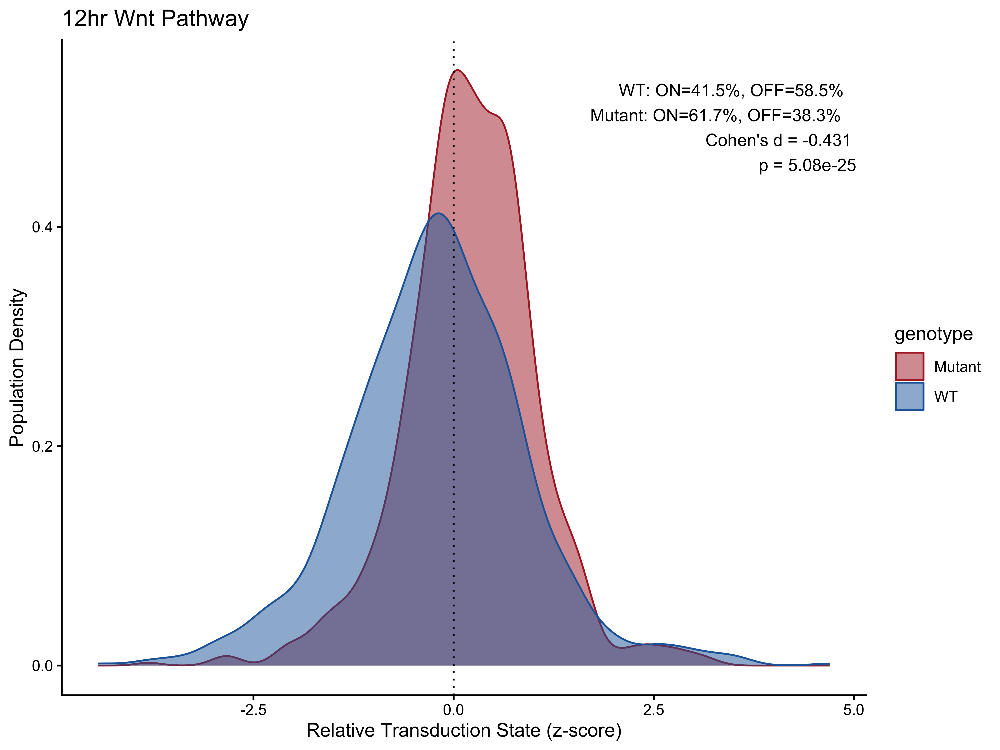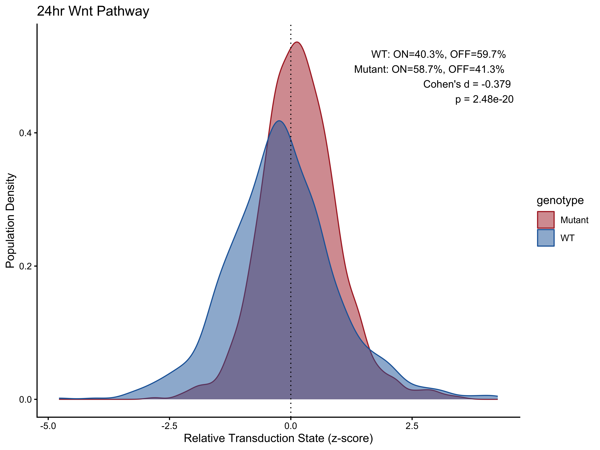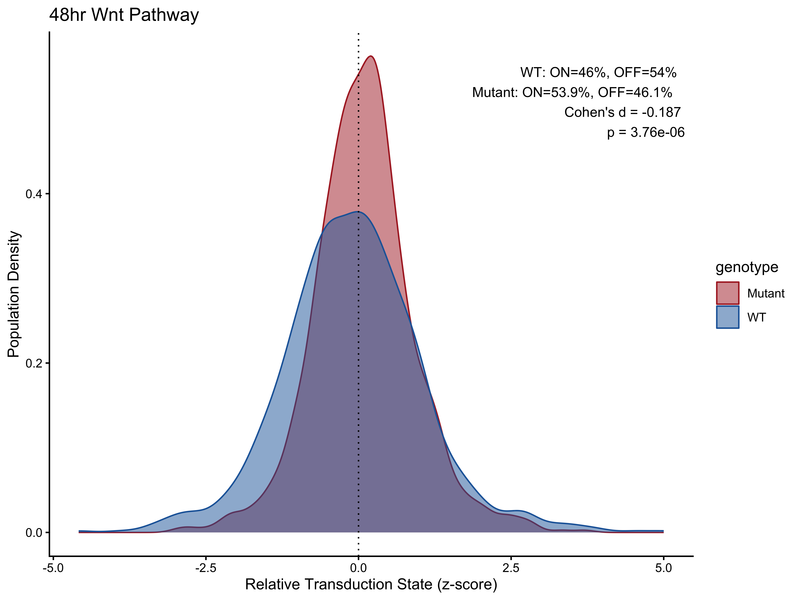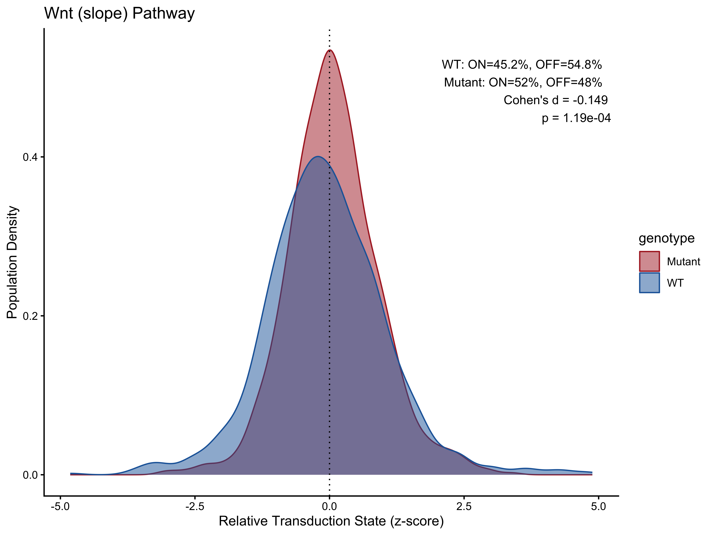

------------------------------------------------------------------------

## Visualization 2 — Violin + Jitter Plot

``` r
p5 <- ggplot(plot_data_12h,
       aes(x = genotype, y = scale, fill = genotype, color = genotype)) +
  geom_violin(alpha = 0.5, trim = FALSE) +
  geom_jitter(width = 0.15, size = 0.6, alpha = 0.3) +
  geom_hline(yintercept = 0, linetype = "dotted", color = "black", linewidth = 0.5) +
  scale_fill_manual(values  = c("#ae282c", "#2066a8")) +
  scale_color_manual(values = c("#ae282c", "#2066a8")) +
  annotate("text", x = Inf, y = Inf, hjust = 1.1, vjust = 1.5,
           label = make_label(pct_12h, "WT", "Mutant"), size = 3.5, color = "black") +
  labs(title = "12hr WNT Pathway Activation",
       x = NULL, y = "Relative Transduction State (z-score)") +
  theme_classic() +
  theme(legend.position = "none")
p5
```

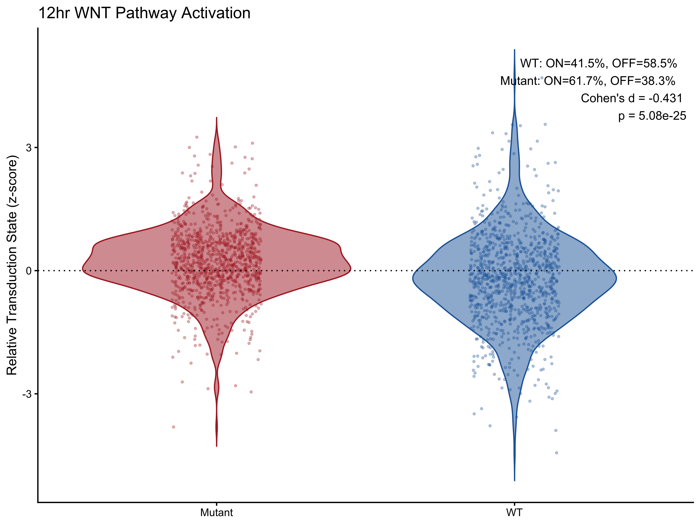

------------------------------------------------------------------------

## Visualization 3 — Waterfall Plot

``` r
waterfall_data <- plot_data_12h %>%
  group_by(genotype) %>%
  arrange(scale, .by_group = TRUE) %>%
  mutate(rank  = row_number(),
         state = ifelse(scale >= 0, "ON", "OFF")) %>%
  ungroup()

annotation_df <- pct_12h %>%
  mutate(
    label = paste0("Cohen's d = ", round(cohens_d, 3), "\n",
                   "p = ", formatC(p_value, format = "e", digits = 2), "\n",
                   "ON = ", percentage_on, "%\n",
                   "OFF = ", percentage_off, "%"),
    genotype = group
  )

p6 <- ggplot(waterfall_data, aes(x = rank, y = scale, fill = state)) +
  geom_bar(stat = "identity", width = 1) +
  facet_wrap(~ genotype, scales = "free_x") +
  scale_fill_manual(values = c("ON" = "#ae282c", "OFF" = "#2066a8")) +
  geom_hline(yintercept = 0, color = "black", linewidth = 0.4) +
  geom_text(data = annotation_df,
            aes(x = Inf, y = Inf, label = label),
            hjust = 1.1, vjust = 1.5, size = 3, color = "black",
            inherit.aes = FALSE) +
  labs(title = "Waterfall Plot of Cell Activation",
       x = "Cells (ranked by activation)",
       y = "Relative Transduction State (z-score)",
       fill = "State") +
  theme_classic() +
  theme(axis.text.x = element_blank(), axis.ticks.x = element_blank(),
        strip.background = element_rect(fill = "grey90", color = NA))
p6
```

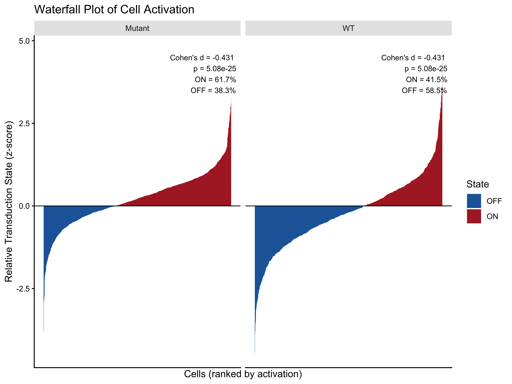

------------------------------------------------------------------------

## Customize Pathway Input

``` r
# Customize the wnt pathway using coefficients defined by us
Wnt.molecules <- c('Lgr5','Rnf43','Lrp5',
           'Lrp6','Fzd6','Ctnnb1',
           'Gsk3b','Ccnd1','Axin2',
           'Myc','Lef1','Tcf7',
           'Tcf7l1','Tcf7l2','Tle1',
           'Apc','Csnk1a1','Dvl1')
Wnt.cof <- c(1,1,-1,-1,-1,-1, 1,1,1, 1,1,1, 1,1,1, -1,-1,-1) 
Wnt_df <- data.frame(
  Gene_Symbol = Wnt.molecules,
  Coefficient = Wnt.cof)

print(Wnt_df)
#>    Gene_Symbol Coefficient
#> 1         Lgr5           1
#> 2        Rnf43           1
#> 3         Lrp5          -1
#> 4         Lrp6          -1
#> 5         Fzd6          -1
#> 6       Ctnnb1          -1
#> 7        Gsk3b           1
#> 8        Ccnd1           1
#> 9        Axin2           1
#> 10         Myc           1
#> 11        Lef1           1
#> 12        Tcf7           1
#> 13      Tcf7l1           1
#> 14      Tcf7l2           1
#> 15        Tle1           1
#> 16         Apc          -1
#> 17     Csnk1a1          -1
#> 18        Dvl1          -1

# Calculate score using customized pathway data
matrix_df   <- DataPreProcess(synthetic_test_object_100, Wnt_df,   Seurat.object = TRUE)
pathwaystat_df   <- PathwayMaxMin(matrix_df,   Wnt_df)
score_df   <- ComputeCellData(matrix_df,   pathwaystat_df)
#> Computing distance...
plot_data_df   <- PreparePlotData(synthetic_test_metadata, score_df,   group = "genotype")
pct_df   <- CalculatePercentage(to.plot = plot_data_df,   group_var = "genotype")
PlotPathway(plot_data_df,   "Customized Wnt",    "genotype", c("#ae282c", "#2066a8")) +
  annotate("text", x = Inf, y = Inf, hjust = 1.1, vjust = 1.5,
           label = make_label(pct_df, "WT", "Mutant"), size = 3.5, color = "black")
```


## Null Distribution — Random Gene Sets

``` r
set.seed(123)

real_n_genes  <- nrow(matrix_12h)
real_cohens_d <- pct_12h$cohens_d[1]
n_reps        <- 20

# Sparse size grid covering the relevant range, always including real n
size_grid <- sort(unique(c(
  seq(5, 50,  by = 5),
  seq(60, 200, by = 20),
  real_n_genes
)))

all_genes_pool <- rownames(
  GetAssayData(synthetic_test_object_100, assay = "RNA", layer = "data")
)
size_grid <- size_grid[size_grid <= length(all_genes_pool)]

cohens_d_random <- data.frame()

for (i in size_grid) {
  for (rep in seq_len(n_reps)) {
    sampled_genes <- sample(all_genes_pool, i)
    fake_pathway  <- data.frame(
      Gene_Symbol = sampled_genes,
      Coefficient = sample(c(-1L, 1L), i, replace = TRUE)
    )
    expr_matrix      <- DataPreProcess(synthetic_test_object_100, fake_pathway,
                                       Seurat.object = TRUE)
    pathwaystat_rand <- PathwayMaxMin(expr_matrix, fake_pathway)
    score_rand       <- ComputeCellData(expr_matrix, pathwaystat_rand)
    plot_data_rand   <- PreparePlotData(synthetic_test_metadata, score_rand,
                                        group = "genotype")
    outcome_rand     <- CalculatePercentage(plot_data_rand, group_var = "genotype")

    cohens_d_random <- rbind(cohens_d_random, data.frame(
      n_genes  = i,
      rep      = rep,
      cohens_d = outcome_rand$cohens_d[1]
    ))
  }
}
#> Computing distance...
#> Computing distance...
#> Computing distance...
#> Computing distance...
#> Computing distance...
#> Computing distance...
#> Computing distance...
#> Computing distance...
#> Computing distance...
#> Computing distance...
#> Computing distance...
#> Computing distance...
#> Computing distance...
#> Computing distance...
#> Computing distance...
#> Computing distance...
#> Computing distance...
#> Computing distance...
#> Computing distance...
#> Computing distance...
#> Computing distance...
#> Computing distance...
#> Computing distance...
#> Computing distance...
#> Computing distance...
#> Computing distance...
#> Computing distance...
#> Computing distance...
#> Computing distance...
#> Computing distance...
#> Computing distance...
#> Computing distance...
#> Computing distance...
#> Computing distance...
#> Computing distance...
#> Computing distance...
#> Computing distance...
#> Computing distance...
#> Computing distance...
#> Computing distance...
#> Computing distance...
#> Computing distance...
#> Computing distance...
#> Computing distance...
#> Computing distance...
#> Computing distance...
#> Computing distance...
#> Computing distance...
#> Computing distance...
#> Computing distance...
#> Computing distance...
#> Computing distance...
#> Computing distance...
#> Computing distance...
#> Computing distance...
#> Computing distance...
#> Computing distance...
#> Computing distance...
#> Computing distance...
#> Computing distance...
#> Computing distance...
#> Computing distance...
#> Computing distance...
#> Computing distance...
#> Computing distance...
#> Computing distance...
#> Computing distance...
#> Computing distance...
#> Computing distance...
#> Computing distance...
#> Computing distance...
#> Computing distance...
#> Computing distance...
#> Computing distance...
#> Computing distance...
#> Computing distance...
#> Computing distance...
#> Computing distance...
#> Computing distance...
#> Computing distance...
#> Computing distance...
#> Computing distance...
#> Computing distance...
#> Computing distance...
#> Computing distance...
#> Computing distance...
#> Computing distance...
#> Computing distance...
#> Computing distance...
#> Computing distance...
#> Computing distance...
#> Computing distance...
#> Computing distance...
#> Computing distance...
#> Computing distance...
#> Computing distance...
#> Computing distance...
#> Computing distance...
#> Computing distance...
#> Computing distance...
#> Computing distance...
#> Computing distance...
#> Computing distance...
#> Computing distance...
#> Computing distance...
#> Computing distance...
#> Computing distance...
#> Computing distance...
#> Computing distance...
#> Computing distance...
#> Computing distance...
#> Computing distance...
#> Computing distance...
#> Computing distance...
#> Computing distance...
#> Computing distance...
#> Computing distance...
#> Computing distance...
#> Computing distance...
#> Computing distance...
#> Computing distance...
#> Computing distance...
#> Computing distance...
#> Computing distance...
#> Computing distance...
#> Computing distance...
#> Computing distance...
#> Computing distance...
#> Computing distance...
#> Computing distance...
#> Computing distance...
#> Computing distance...
#> Computing distance...
#> Computing distance...
#> Computing distance...
#> Computing distance...
#> Computing distance...
#> Computing distance...
#> Computing distance...
#> Computing distance...
#> Computing distance...
#> Computing distance...
#> Computing distance...
#> Computing distance...
#> Computing distance...
#> Computing distance...
#> Computing distance...
#> Computing distance...
#> Computing distance...
#> Computing distance...
#> Computing distance...
#> Computing distance...
#> Computing distance...
#> Computing distance...
#> Computing distance...
#> Computing distance...
#> Computing distance...
#> Computing distance...
#> Computing distance...
#> Computing distance...
#> Computing distance...
#> Computing distance...
#> Computing distance...
#> Computing distance...
#> Computing distance...
#> Computing distance...
#> Computing distance...
#> Computing distance...
#> Computing distance...
#> Computing distance...
#> Computing distance...
#> Computing distance...
#> Computing distance...
#> Computing distance...
#> Computing distance...
#> Computing distance...
#> Computing distance...
#> Computing distance...
#> Computing distance...
#> Computing distance...
#> Computing distance...
#> Computing distance...
#> Computing distance...
#> Computing distance...
#> Computing distance...
#> Computing distance...
#> Computing distance...
#> Computing distance...
#> Computing distance...
#> Computing distance...
#> Computing distance...
#> Computing distance...
#> Computing distance...
#> Computing distance...
#> Computing distance...
#> Computing distance...
#> Computing distance...
#> Computing distance...
#> Computing distance...
#> Computing distance...
#> Computing distance...
#> Computing distance...
#> Computing distance...
#> Computing distance...
#> Computing distance...
#> Computing distance...
#> Computing distance...
#> Computing distance...
#> Computing distance...
#> Computing distance...
#> Computing distance...
#> Computing distance...
#> Computing distance...
#> Computing distance...
#> Computing distance...
#> Computing distance...
#> Computing distance...
#> Computing distance...
#> Computing distance...
#> Computing distance...
#> Computing distance...
#> Computing distance...
#> Computing distance...
#> Computing distance...
#> Computing distance...
#> Computing distance...
#> Computing distance...
#> Computing distance...
#> Computing distance...
#> Computing distance...
#> Computing distance...
#> Computing distance...
#> Computing distance...
#> Computing distance...
#> Computing distance...
#> Computing distance...
#> Computing distance...
#> Computing distance...
#> Computing distance...
#> Computing distance...
#> Computing distance...
#> Computing distance...
#> Computing distance...
#> Computing distance...
#> Computing distance...
#> Computing distance...
#> Computing distance...
#> Computing distance...
#> Computing distance...
#> Computing distance...
#> Computing distance...
#> Computing distance...
#> Computing distance...
#> Computing distance...
#> Computing distance...
#> Computing distance...
#> Computing distance...
#> Computing distance...
#> Computing distance...
#> Computing distance...
#> Computing distance...
#> Computing distance...
#> Computing distance...
#> Computing distance...
#> Computing distance...
#> Computing distance...
#> Computing distance...
#> Computing distance...
#> Computing distance...
#> Computing distance...
#> Computing distance...
#> Computing distance...
#> Computing distance...
#> Computing distance...
#> Computing distance...
#> Computing distance...
#> Computing distance...
#> Computing distance...
#> Computing distance...
#> Computing distance...

cohens_d_summary_rand <- cohens_d_random %>%
  group_by(n_genes) %>%
  summarise(mean_d = mean(cohens_d, na.rm = TRUE),
            sd_d   = sd(cohens_d,   na.rm = TRUE),
            .groups = "drop")

null_at_real_n <- cohens_d_random %>% filter(n_genes == real_n_genes)
emp_p <- mean(abs(null_at_real_n$cohens_d) >= abs(real_cohens_d), na.rm = TRUE)

cat("Real pathway Cohen's d:    ", round(real_cohens_d, 3), "\n")
#> Real pathway Cohen's d:     -0.431
cat("Null mean at same n genes: ", round(mean(null_at_real_n$cohens_d, na.rm = TRUE), 3), "\n")
#> Null mean at same n genes:  -0.082
cat("Null SD at same n genes:   ", round(sd(null_at_real_n$cohens_d,   na.rm = TRUE), 3), "\n")
#> Null SD at same n genes:    0.328
cat("Empirical p-value:         ", round(emp_p, 3), "\n")
#> Empirical p-value:          0.25

p7 <- ggplot() +
  geom_hline(yintercept =  0,   linetype = "solid",  color = "#888780", linewidth = 0.4) +
  geom_hline(yintercept =  0.8, linetype = "dashed", color = "#E24B4A", linewidth = 0.5) +
  geom_hline(yintercept = -0.8, linetype = "dashed", color = "#E24B4A", linewidth = 0.5) +
  geom_hline(yintercept =  0.5, linetype = "dashed", color = "#EF9F27", linewidth = 0.5) +
  geom_hline(yintercept = -0.5, linetype = "dashed", color = "#EF9F27", linewidth = 0.5) +
  geom_point(data = cohens_d_random,
             aes(x = n_genes, y = cohens_d),
             color = "#534AB7", alpha = 0.25, size = 1.2) +
  geom_ribbon(data = cohens_d_summary_rand,
              aes(x = n_genes, ymin = mean_d - sd_d, ymax = mean_d + sd_d),
              fill = "#534AB7", alpha = 0.15) +
  geom_line(data = cohens_d_summary_rand,
            aes(x = n_genes, y = mean_d),
            color = "#534AB7", linewidth = 0.9) +
  geom_point(aes(x = real_n_genes, y = real_cohens_d),
             color = "#E24B4A", size = 3, shape = 18) +
  geom_vline(xintercept = real_n_genes, color = "#E24B4A",
             linetype = "dashed", linewidth = 0.5) +
  annotate("text", x = real_n_genes, y = Inf,
           label = paste0("Real pathway\nn = ", real_n_genes,
                          "\nd = ", round(real_cohens_d, 3),
                          "\nemp. p = ", round(emp_p, 3)),
           hjust = -0.1, vjust = 1.5, size = 3, color = "#E24B4A") +
  annotate("text", x = max(cohens_d_summary_rand$n_genes), y =  0.82,
           label = "large (+0.8)",  hjust = 1, size = 3, color = "#E24B4A") +
  annotate("text", x = max(cohens_d_summary_rand$n_genes), y = -0.82,
           label = "large (-0.8)",  hjust = 1, size = 3, color = "#E24B4A") +
  annotate("text", x = max(cohens_d_summary_rand$n_genes), y =  0.52,
           label = "medium (+0.5)", hjust = 1, size = 3, color = "#EF9F27") +
  annotate("text", x = max(cohens_d_summary_rand$n_genes), y = -0.52,
           label = "medium (-0.5)", hjust = 1, size = 3, color = "#EF9F27") +
  labs(title = "Null Distribution — Cohen's d by Gene Set Size",
       x = "Number of genes", y = "Cohen's d") +
  theme_minimal()
p7
```

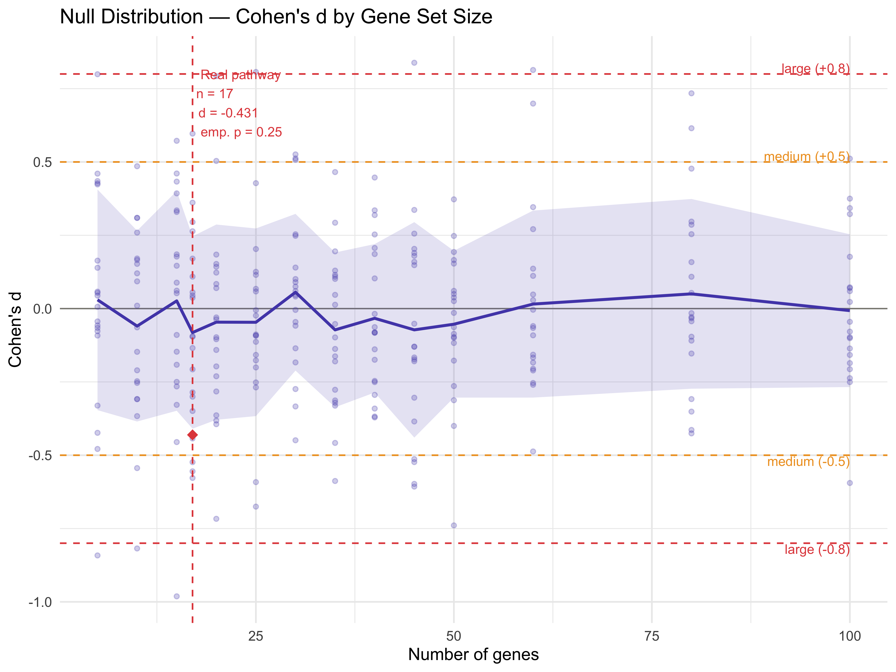

------------------------------------------------------------------------

## Null Distribution — Within Pathway Gene Pool

``` r
set.seed(123)

all_genes <- rownames(matrix_12h)
n_genes   <- length(all_genes)
n_reps    <- 10

cohens_d_pathway <- data.frame()

for (i in 2:n_genes) {
  for (rep in seq_len(n_reps)) {
    sampled_genes    <- sample(all_genes, i)
    expr_matrix      <- matrix_12h[sampled_genes, , drop = FALSE]
    pathwaystat_rand <- PathwayMaxMin(expr_matrix, Wnt_12h)
    score_rand       <- ComputeCellData(expr_matrix, pathwaystat_rand)
    plot_data_rand   <- PreparePlotData(synthetic_test_metadata, score_rand,
                                        group = "genotype")
    outcome_rand     <- CalculatePercentage(to.plot   = plot_data_rand,
                                            group_var = "genotype")
    cohens_d_pathway <- rbind(cohens_d_pathway, data.frame(
      n_genes  = i,
      rep      = rep,
      cohens_d = outcome_rand$cohens_d[1]
    ))
  }
}
#> Computing distance...
#> Computing distance...
#> Computing distance...
#> Computing distance...
#> Computing distance...
#> Computing distance...
#> Computing distance...
#> Computing distance...
#> Computing distance...
#> Computing distance...
#> Computing distance...
#> Computing distance...
#> Computing distance...
#> Computing distance...
#> Computing distance...
#> Computing distance...
#> Computing distance...
#> Computing distance...
#> Computing distance...
#> Computing distance...
#> Computing distance...
#> Computing distance...
#> Computing distance...
#> Computing distance...
#> Computing distance...
#> Computing distance...
#> Computing distance...
#> Computing distance...
#> Computing distance...
#> Computing distance...
#> Computing distance...
#> Computing distance...
#> Computing distance...
#> Computing distance...
#> Computing distance...
#> Computing distance...
#> Computing distance...
#> Computing distance...
#> Computing distance...
#> Computing distance...
#> Computing distance...
#> Computing distance...
#> Computing distance...
#> Computing distance...
#> Computing distance...
#> Computing distance...
#> Computing distance...
#> Computing distance...
#> Computing distance...
#> Computing distance...
#> Computing distance...
#> Computing distance...
#> Computing distance...
#> Computing distance...
#> Computing distance...
#> Computing distance...
#> Computing distance...
#> Computing distance...
#> Computing distance...
#> Computing distance...
#> Computing distance...
#> Computing distance...
#> Computing distance...
#> Computing distance...
#> Computing distance...
#> Computing distance...
#> Computing distance...
#> Computing distance...
#> Computing distance...
#> Computing distance...
#> Computing distance...
#> Computing distance...
#> Computing distance...
#> Computing distance...
#> Computing distance...
#> Computing distance...
#> Computing distance...
#> Computing distance...
#> Computing distance...
#> Computing distance...
#> Computing distance...
#> Computing distance...
#> Computing distance...
#> Computing distance...
#> Computing distance...
#> Computing distance...
#> Computing distance...
#> Computing distance...
#> Computing distance...
#> Computing distance...
#> Computing distance...
#> Computing distance...
#> Computing distance...
#> Computing distance...
#> Computing distance...
#> Computing distance...
#> Computing distance...
#> Computing distance...
#> Computing distance...
#> Computing distance...
#> Computing distance...
#> Computing distance...
#> Computing distance...
#> Computing distance...
#> Computing distance...
#> Computing distance...
#> Computing distance...
#> Computing distance...
#> Computing distance...
#> Computing distance...
#> Computing distance...
#> Computing distance...
#> Computing distance...
#> Computing distance...
#> Computing distance...
#> Computing distance...
#> Computing distance...
#> Computing distance...
#> Computing distance...
#> Computing distance...
#> Computing distance...
#> Computing distance...
#> Computing distance...
#> Computing distance...
#> Computing distance...
#> Computing distance...
#> Computing distance...
#> Computing distance...
#> Computing distance...
#> Computing distance...
#> Computing distance...
#> Computing distance...
#> Computing distance...
#> Computing distance...
#> Computing distance...
#> Computing distance...
#> Computing distance...
#> Computing distance...
#> Computing distance...
#> Computing distance...
#> Computing distance...
#> Computing distance...
#> Computing distance...
#> Computing distance...
#> Computing distance...
#> Computing distance...
#> Computing distance...
#> Computing distance...
#> Computing distance...
#> Computing distance...
#> Computing distance...
#> Computing distance...
#> Computing distance...
#> Computing distance...
#> Computing distance...
#> Computing distance...
#> Computing distance...
#> Computing distance...
#> Computing distance...
#> Computing distance...

cohens_d_summary_pw <- cohens_d_pathway %>%
  group_by(n_genes) %>%
  summarise(mean_d = mean(cohens_d, na.rm = TRUE),
            sd_d   = sd(cohens_d,   na.rm = TRUE),
            .groups = "drop")

null_at_real_n_pw <- cohens_d_pathway %>% filter(n_genes == real_n_genes)
emp_p_pw <- mean(abs(null_at_real_n_pw$cohens_d) >= abs(real_cohens_d), na.rm = TRUE)

cat("Real pathway Cohen's d:    ", round(real_cohens_d, 3), "\n")
#> Real pathway Cohen's d:     -0.431
cat("Null mean at same n genes: ", round(mean(null_at_real_n_pw$cohens_d, na.rm = TRUE), 3), "\n")
#> Null mean at same n genes:  -0.431
cat("Null SD at same n genes:   ", round(sd(null_at_real_n_pw$cohens_d,   na.rm = TRUE), 3), "\n")
#> Null SD at same n genes:    0
cat("Empirical p-value:         ", round(emp_p_pw, 3), "\n")
#> Empirical p-value:          0.6

p_null <- ggplot() +
  geom_hline(yintercept =  0,   linetype = "solid",  color = "#888780", linewidth = 0.4) +
  geom_hline(yintercept =  0.8, linetype = "dashed", color = "#E24B4A", linewidth = 0.5) +
  geom_hline(yintercept = -0.8, linetype = "dashed", color = "#E24B4A", linewidth = 0.5) +
  geom_hline(yintercept =  0.5, linetype = "dashed", color = "#EF9F27", linewidth = 0.5) +
  geom_hline(yintercept = -0.5, linetype = "dashed", color = "#EF9F27", linewidth = 0.5) +
  geom_point(data = cohens_d_pathway,
             aes(x = n_genes, y = cohens_d),
             color = "#534AB7", alpha = 0.25, size = 1.2) +
  geom_ribbon(data = cohens_d_summary_pw,
              aes(x = n_genes, ymin = mean_d - sd_d, ymax = mean_d + sd_d),
              fill = "#534AB7", alpha = 0.15) +
  geom_line(data = cohens_d_summary_pw,
            aes(x = n_genes, y = mean_d),
            color = "#534AB7", linewidth = 0.9) +
  geom_point(aes(x = real_n_genes, y = real_cohens_d),
             color = "#E24B4A", size = 3, shape = 18) +
  geom_vline(xintercept = real_n_genes, color = "#E24B4A",
             linetype = "dashed", linewidth = 0.5) +
  annotate("text", x = real_n_genes, y = Inf,
           label = paste0("Real pathway\nn = ", real_n_genes,
                          "\nd = ", round(real_cohens_d, 3)),
           hjust = -0.1, vjust = 1.5, size = 3, color = "#E24B4A") +
  labs(title = "Null Distribution — Cohen's d by Gene Set Size (10 reps each)",
       x = "Number of genes", y = "Cohen's d") +
  theme_minimal()
p_null
```

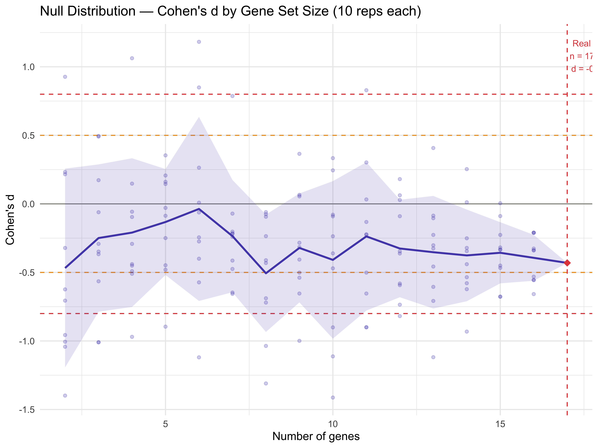

------------------------------------------------------------------------

## Sensitivity Analysis 1 — Effect of Input Matrix Type

``` r
data("synthetic_test_matrix_100")

matrix_raw     <- synthetic_test_matrix_100
lib_size       <- colSums(synthetic_test_matrix_100)
matrix_lognorm <- log1p(sweep(synthetic_test_matrix_100, 2, lib_size, "/") * 1e4)
matrix_norm    <- sweep(synthetic_test_matrix_100, 2, lib_size, "/") * 1e4
gene_var       <- apply(matrix_lognorm, 1, var)
hvg_genes      <- names(sort(gene_var, decreasing = TRUE))[
                    1:ceiling(nrow(matrix_lognorm) * 0.5)]
matrix_hvg     <- matrix_lognorm[hvg_genes, ]

run_pipeline <- function(expr_mat, pathwaydata, metadata, group,
                          scale.data = TRUE) {
  mat      <- DataPreProcess(expr_mat, pathwaydata, scale.data = scale.data)
  pstat    <- PathwayMaxMin(mat, pathwaydata)
  score    <- ComputeCellData(mat, pstat)
  plotdata <- PreparePlotData(metadata, score, group = group)
  outcome  <- CalculatePercentage(plotdata, group_var = group)
  list(score = score, plotdata = plotdata, outcome = outcome)
}

result_raw             <- run_pipeline(matrix_raw,     Wnt_12h, synthetic_test_metadata, "genotype")
#> Computing distance...
result_lognorm         <- run_pipeline(matrix_lognorm, Wnt_12h, synthetic_test_metadata, "genotype")
#> Computing distance...
result_norm            <- run_pipeline(matrix_norm,    Wnt_12h, synthetic_test_metadata, "genotype")
#> Computing distance...
result_hvg             <- run_pipeline(matrix_hvg,     Wnt_12h, synthetic_test_metadata, "genotype")
#> Computing distance...
result_raw_noscale     <- run_pipeline(matrix_raw,     Wnt_12h, synthetic_test_metadata, "genotype", scale.data = FALSE)
#> Computing distance...
result_lognorm_noscale <- run_pipeline(matrix_lognorm, Wnt_12h, synthetic_test_metadata, "genotype", scale.data = FALSE)
#> Computing distance...
result_norm_noscale    <- run_pipeline(matrix_norm,    Wnt_12h, synthetic_test_metadata, "genotype", scale.data = FALSE)
#> Computing distance...
result_hvg_noscale     <- run_pipeline(matrix_hvg,     Wnt_12h, synthetic_test_metadata, "genotype", scale.data = FALSE)
#> Computing distance...

input_labels <- c("Raw", "Log-norm", "Norm", "HVG",
                   "Raw (noscale)", "Log-norm (noscale)",
                   "Norm (noscale)", "HVG (noscale)")
results_list <- list(result_raw, result_lognorm, result_norm, result_hvg,
                      result_raw_noscale, result_lognorm_noscale,
                      result_norm_noscale, result_hvg_noscale)

cohens_d_input <- data.frame(
  input_type = input_labels,
  cohens_d   = sapply(results_list, function(r) r$outcome$cohens_d[1]),
  p_value    = sapply(results_list, function(r) r$outcome$p_value[1])
)
print(cohens_d_input)
#>           input_type    cohens_d      p_value
#> 1                Raw -0.80105995 1.120664e-65
#> 2           Log-norm -0.43058889 5.083976e-25
#> 3               Norm -0.38149058 2.648944e-18
#> 4                HVG -0.02940827 5.222419e-01
#> 5      Raw (noscale) -0.99496812 9.932645e-94
#> 6 Log-norm (noscale) -0.22648846 5.743074e-07
#> 7     Norm (noscale) -0.42743835 2.281451e-22
#> 8      HVG (noscale) -0.02943217 5.259599e-01

score_df_sens <- as.data.frame(
  setNames(lapply(results_list, function(r) as.numeric(r$score)), input_labels),
  row.names = names(results_list[[1]]$score)
)

score_cor <- cor(score_df_sens, method = "spearman", use = "pairwise.complete.obs")
p12 <- pheatmap(score_cor,
         color = colorRampPalette(c("#185FA5", "white", "#993C1D"))(100),
         breaks = seq(-1, 1, length.out = 101),
         display_numbers = TRUE, number_format = "%.2f",
         fontsize_number = 9,
         main = "Score Correlation Across Input Matrix Types — Spearman")

named_results <- list(Raw = result_raw, `Log-norm` = result_lognorm,
                       Norm = result_norm, HVG = result_hvg)
density_plots <- lapply(
  names(named_results),
  function(nm) PlotPathway(named_results[[nm]]$plotdata,
                            paste("Wnt 12h —", nm), "genotype",
                            c("#ae282c", "#2066a8"))
)
p13 <- wrap_plots(density_plots, ncol = 2) +
  plot_annotation(title = "Pathway Activation by Input Matrix Type")

p12; p13
```

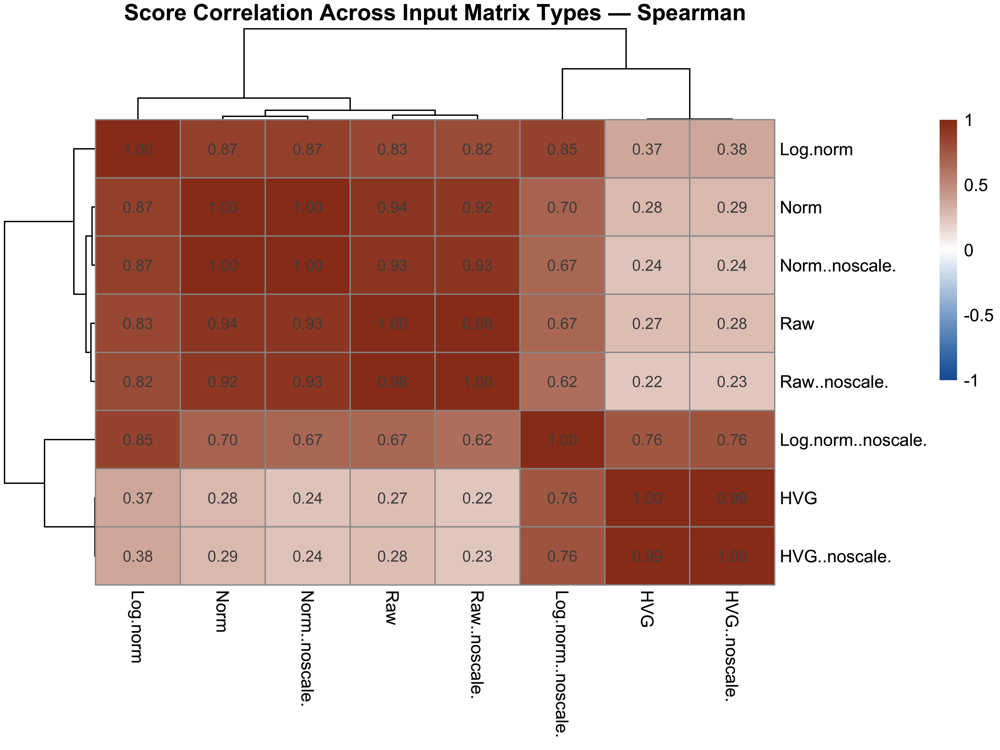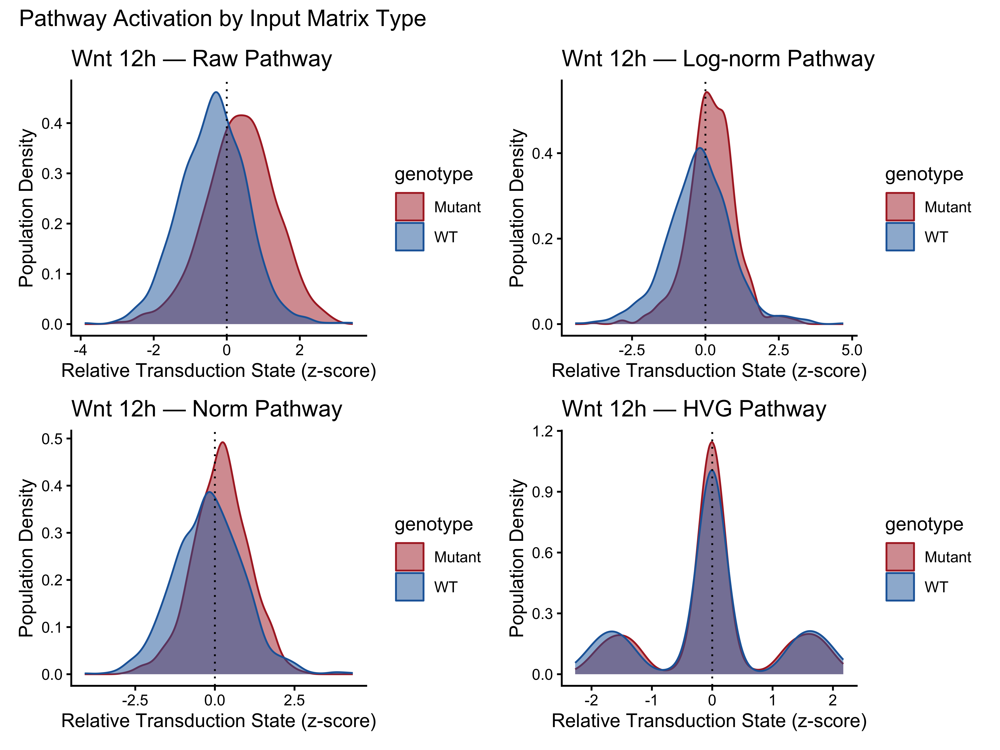

------------------------------------------------------------------------

## Correlation with Technical Confounders

``` r
normalized_mat <- GetAssayData(synthetic_test_object_100, assay = "RNA", layer = "data")
common_genes   <- intersect(rownames(normalized_mat), Wnt_12h$Gene_Symbol)
gene_matrix    <- as.matrix(normalized_mat[common_genes, ])

mean_expr            <- colMeans(gene_matrix, na.rm = TRUE)
zscore_mean_per_cell <- colMeans(t(scale(t(gene_matrix))), na.rm = TRUE)
seurat_meta          <- synthetic_test_object_100@meta.data

make_scatter <- function(df, x_col, x_label) {
  r <- cor(df$embed_score, df[[x_col]], method = "spearman", use = "complete.obs")
  ggplot(df, aes(x = .data[[x_col]], y = embed_score)) +
    geom_point(alpha = 0.4, size = 1.2, color = "#534AB7") +
    geom_smooth(method = "lm", color = "#E24B4A", linewidth = 0.8, se = TRUE) +
    labs(title = sprintf("%s (rho = %.3f)", x_label, r),
         x = x_label, y = "PathwayEmbed score") +
    theme_minimal()
}

confounder_df_norm <- data.frame(
  cell         = names(score_12h),
  embed_score  = as.numeric(score_12h),
  mean_expr    = mean_expr[names(score_12h)],
  zscore_expr  = zscore_mean_per_cell[names(score_12h)],
  nCount_RNA   = seurat_meta[names(score_12h), "nCount_RNA"],
  nFeature_RNA = seurat_meta[names(score_12h), "nFeature_RNA"]
)

for (cov in c("mean_expr", "zscore_expr", "nCount_RNA", "nFeature_RNA")) {
  r <- cor(confounder_df_norm$embed_score, confounder_df_norm[[cov]],
           method = "spearman", use = "complete.obs")
  cat(sprintf("Spearman vs %-20s : %.3f\n", cov, r))
}
#> Spearman vs mean_expr            : 0.163
#> Spearman vs zscore_expr          : 0.280
#> Spearman vs nCount_RNA           : 0.089
#> Spearman vs nFeature_RNA         : -0.145

p_nor <- (make_scatter(confounder_df_norm, "mean_expr",    "Mean expression") +
           make_scatter(confounder_df_norm, "zscore_expr",  "Z-score mean")) /
          (make_scatter(confounder_df_norm, "nCount_RNA",   "nCount_RNA") +
           make_scatter(confounder_df_norm, "nFeature_RNA", "nFeature_RNA"))
p_nor
#> `geom_smooth()` using formula = 'y ~ x'
#> `geom_smooth()` using formula = 'y ~ x'
#> `geom_smooth()` using formula = 'y ~ x'
#> `geom_smooth()` using formula = 'y ~ x'
```

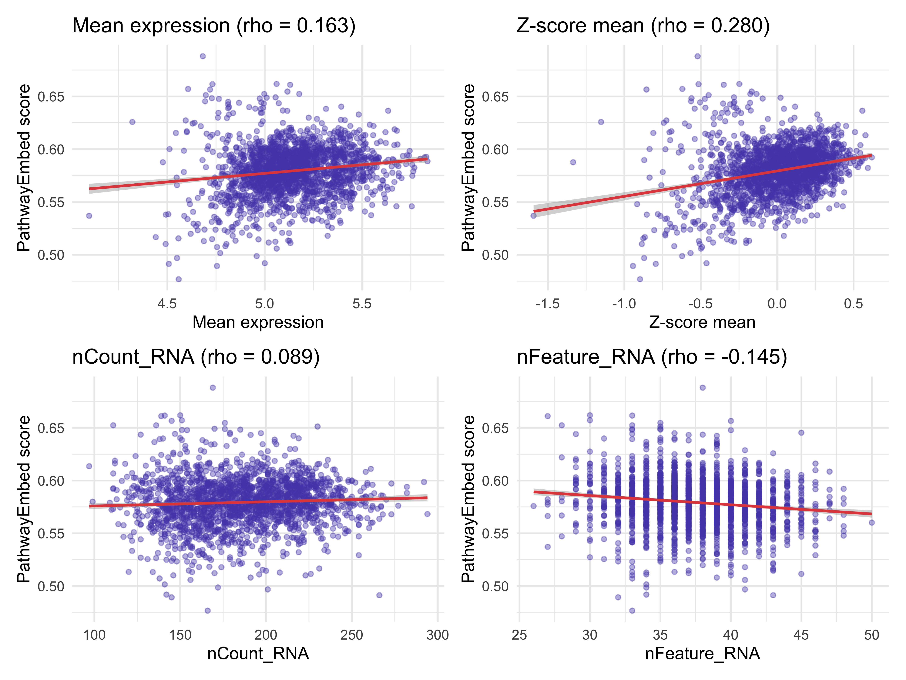

## Correlation with Technical Confounders — Raw Counts

``` r
common_genes_raw <- intersect(rownames(matrix_raw), Wnt_12h$Gene_Symbol)
gene_matrix_raw  <- as.matrix(matrix_raw[common_genes_raw, ])

mean_expr_raw            <- colMeans(gene_matrix_raw, na.rm = TRUE)
zscore_mean_per_cell_raw <- colMeans(t(scale(t(gene_matrix_raw))), na.rm = TRUE)
score_raw_12h            <- result_raw$score

confounder_df_raw <- data.frame(
  cell         = names(score_raw_12h),
  embed_score  = as.numeric(score_raw_12h),
  mean_expr    = mean_expr_raw[names(score_raw_12h)],
  zscore_expr  = zscore_mean_per_cell_raw[names(score_raw_12h)],
  nCount_RNA   = seurat_meta[names(score_raw_12h), "nCount_RNA"],
  nFeature_RNA = seurat_meta[names(score_raw_12h), "nFeature_RNA"]
)

for (cov in c("mean_expr", "zscore_expr", "nCount_RNA", "nFeature_RNA")) {
  r <- cor(confounder_df_raw$embed_score, confounder_df_raw[[cov]],
           method = "spearman", use = "complete.obs")
  cat(sprintf("Spearman vs %-20s : %.3f\n", cov, r))
}
#> Spearman vs mean_expr            : 0.411
#> Spearman vs zscore_expr          : 0.406
#> Spearman vs nCount_RNA           : 0.335
#> Spearman vs nFeature_RNA         : -0.024

p_raw <- (make_scatter(confounder_df_raw, "mean_expr",    "Mean expression") +
           make_scatter(confounder_df_raw, "zscore_expr",  "Z-score mean")) /
          (make_scatter(confounder_df_raw, "nCount_RNA",   "nCount_RNA") +
           make_scatter(confounder_df_raw, "nFeature_RNA", "nFeature_RNA"))
p_raw
#> `geom_smooth()` using formula = 'y ~ x'
#> `geom_smooth()` using formula = 'y ~ x'
#> `geom_smooth()` using formula = 'y ~ x'
#> `geom_smooth()` using formula = 'y ~ x'
```

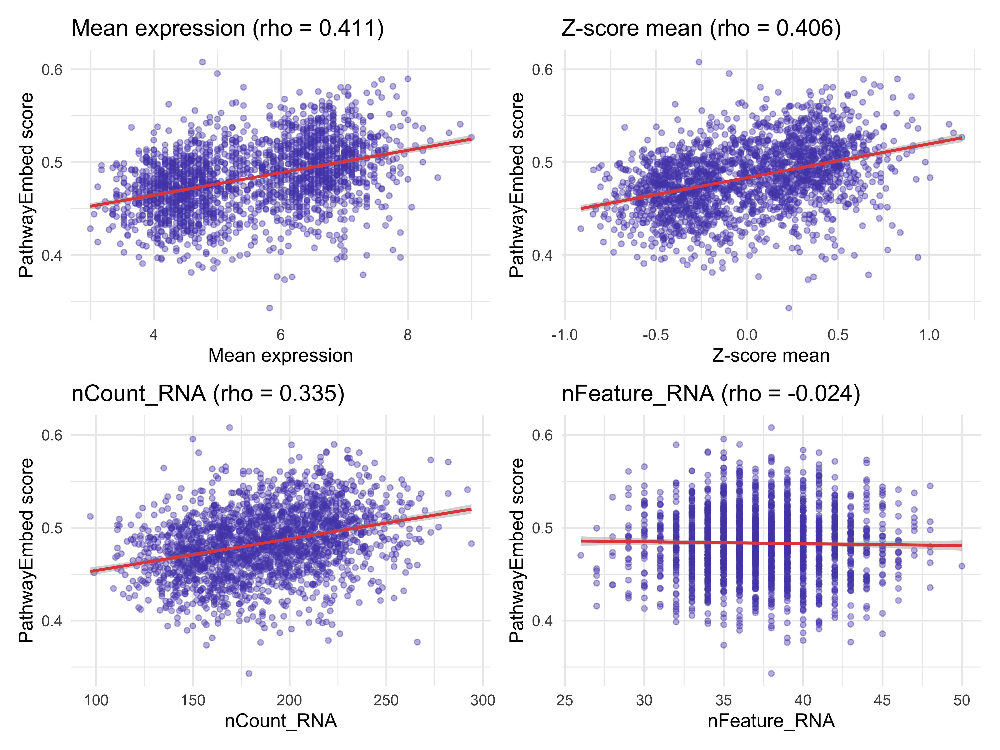

------------------------------------------------------------------------

## Benchmark Against PROGENy and AddModuleScore

``` r
normalized_mat_dense <- as.matrix(normalized_mat)

progeny_scores <- progeny(
  normalized_mat_dense,
  scale    = TRUE,
  organism = "Mouse",
  top      = 100,
  perm     = 1
)
progeny_wnt <- setNames(as.numeric(progeny_scores[, "WNT"]),
                         rownames(progeny_scores))

wnt_features <- rownames(matrix_24h)
synthetic_test_object_100 <- AddModuleScore(
  object   = synthetic_test_object_100,
  features = list(wnt_features),
  name     = "WNT_ModuleScore",
  ctrl     = 5,
  nbin     = 10
)
module_score <- setNames(
  synthetic_test_object_100@meta.data$WNT_ModuleScore1,
  rownames(synthetic_test_object_100@meta.data)
)

cells <- names(score_24h)
benchmark_df <- data.frame(
  PathwayEmbed   = as.numeric(score_24h),
  PROGENy        = as.numeric(progeny_wnt[cells]),
  AddModuleScore = as.numeric(module_score[cells]),
  mean_expr      = as.numeric(mean_expr[cells]),
  zscore_expr    = as.numeric(zscore_mean_per_cell[cells]),
  row.names      = cells
)

benchmark_cor <- cor(benchmark_df, method = "spearman",
                     use = "pairwise.complete.obs")
print(round(benchmark_cor, 3))
#>                PathwayEmbed PROGENy AddModuleScore mean_expr zscore_expr
#> PathwayEmbed          1.000   0.042         -0.049    -0.078      -0.082
#> PROGENy               0.042   1.000          0.028     0.046       0.137
#> AddModuleScore       -0.049   0.028          1.000     0.625       0.440
#> mean_expr            -0.078   0.046          0.625     1.000       0.807
#> zscore_expr          -0.082   0.137          0.440     0.807       1.000

p9 <- pheatmap(
  benchmark_cor,
  color           = colorRampPalette(c("#185FA5", "white", "#993C1D"))(100),
  breaks          = seq(-1, 1, length.out = 101),
  display_numbers = TRUE, number_format = "%.2f",
  fontsize_number = 9,
  main            = "Method Benchmark — Spearman Correlation"
)
p9
```

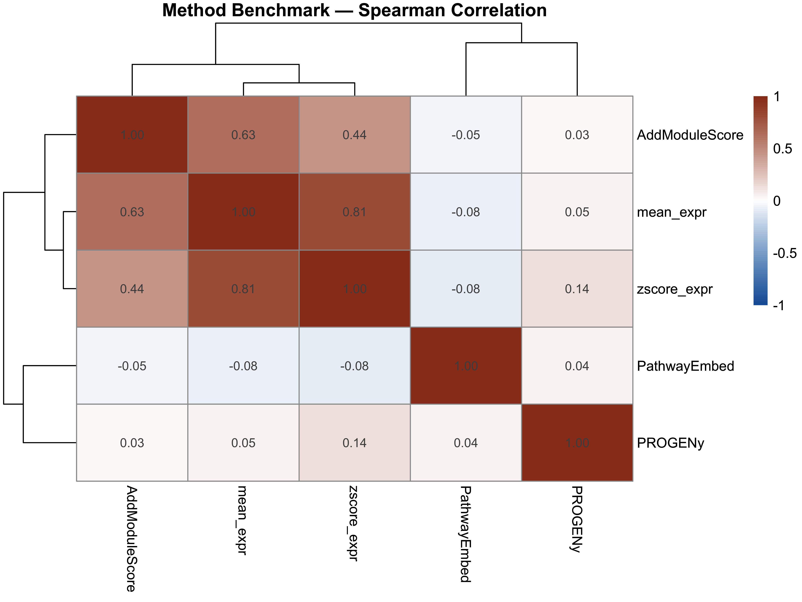

``` r

genotype_label <- ifelse(
  synthetic_test_metadata[cells, "genotype"] == "Mutant", 1L, 0L
)

compute_auroc <- function(scores, labels) {
  r       <- roc(labels, scores, quiet = TRUE)
  auc_val <- as.numeric(auc(r))
  if (auc_val < 0.5) auc_val <- 1 - auc_val
  auc_val
}

auroc_results <- data.frame(
  Method = colnames(benchmark_df),
  AUROC  = sapply(benchmark_df, compute_auroc, labels = genotype_label)
)
auroc_results <- auroc_results[order(-auroc_results$AUROC), ]
print(auroc_results)
#>                        Method    AUROC
#> zscore_expr       zscore_expr 0.755310
#> PROGENy               PROGENy 0.656320
#> mean_expr           mean_expr 0.626260
#> PathwayEmbed     PathwayEmbed 0.619310
#> AddModuleScore AddModuleScore 0.526651

compute_cohens_d_method <- function(scores, metadata, group_col) {
  scores <- setNames(as.numeric(scores), names(scores))
  pd     <- PreparePlotData(metadata, scores, group = group_col)
  pct    <- CalculatePercentage(pd, group_var = group_col)
  abs(pct$cohens_d[1])
}

cohens_d_results <- data.frame(
  Method   = colnames(benchmark_df),
  Cohens_d = sapply(
    colnames(benchmark_df),
    function(m) compute_cohens_d_method(
      setNames(benchmark_df[[m]], rownames(benchmark_df)),
      synthetic_test_metadata, "genotype"
    )
  )
)
cohens_d_results <- cohens_d_results[order(-cohens_d_results$Cohens_d), ]
print(cohens_d_results)
#>                        Method   Cohens_d
#> zscore_expr       zscore_expr 0.94892009
#> mean_expr           mean_expr 0.44722384
#> PathwayEmbed     PathwayEmbed 0.37911019
#> AddModuleScore AddModuleScore 0.07942301
#> PROGENy               PROGENy 0.07087977

method_colors <- c(
  "PathwayEmbed"   = "#534AB7",
  "PROGENy"        = "#E24B4A",
  "AddModuleScore" = "#EF9F27",
  "mean_expr"      = "#888780",
  "zscore_expr"    = "#B4B2A9"
)

p10 <- ggplot(auroc_results, aes(x = reorder(Method, AUROC), y = AUROC, fill = Method)) +
  geom_bar(stat = "identity", width = 0.6) +
  geom_hline(yintercept = 0.5, linetype = "dashed", color = "black") +
  coord_flip() +
  scale_fill_manual(values = method_colors) +
  labs(title = "AUROC: Mutant vs WT separation by scoring method",
       x = NULL, y = "AUROC") +
  ylim(0, 1) +
  theme_classic() +
  theme(legend.position = "none",
        axis.text.y  = element_text(size = 12),
        axis.text.x  = element_text(size = 11),
        axis.title.x = element_text(size = 12),
        plot.title   = element_text(size = 13, face = "bold"))

p11 <- ggplot(cohens_d_results, aes(x = reorder(Method, Cohens_d), y = Cohens_d, fill = Method)) +
  geom_bar(stat = "identity", width = 0.6) +
  geom_hline(yintercept = 0.5, linetype = "dashed", color = "black") +
  coord_flip() +
  scale_fill_manual(values = method_colors) +
  labs(title = "Cohen's d: Mutant vs WT separation by scoring method",
       x = NULL, y = "Cohen's d") +
  ylim(0, 1) +
  theme_classic() +
  theme(legend.position = "none",
        axis.text.y  = element_text(size = 12),
        axis.text.x  = element_text(size = 11),
        axis.title.x = element_text(size = 12),
        plot.title   = element_text(size = 13, face = "bold"))

p10; p11
```

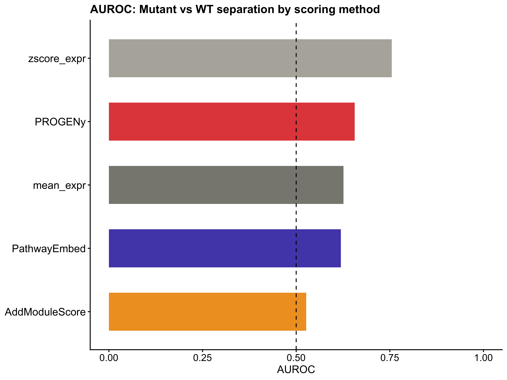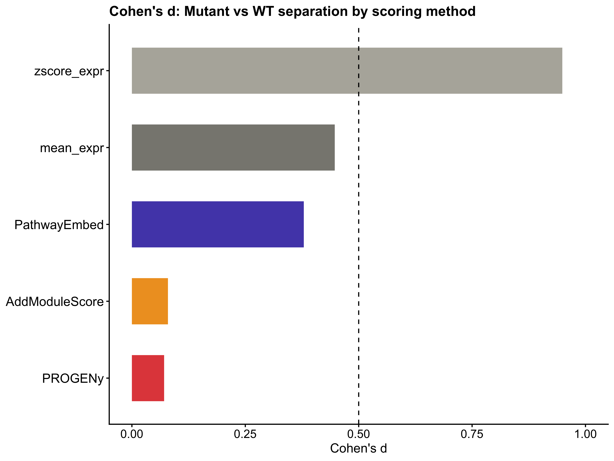

------------------------------------------------------------------------

## Sensitivity Analysis 2 — Effect of Distance Method

``` r
score_manhattan <- ComputeCellData(matrix_24h, pathwaystat_24h,
                                   distance.method = "manhattan")
#> Computing distance...
score_euclidean <- ComputeCellData(matrix_24h, pathwaystat_24h,
                                   distance.method = "euclidean")
#> Computing distance...

cor_dist <- cor(score_manhattan, score_euclidean, method = "spearman")
cat("Spearman correlation (manhattan vs euclidean):", round(cor_dist, 3), "\n")
#> Spearman correlation (manhattan vs euclidean): 0.942

plotdata_manhattan <- PreparePlotData(synthetic_test_metadata, score_manhattan,
                                      group = "genotype")
plotdata_euclidean <- PreparePlotData(synthetic_test_metadata, score_euclidean,
                                      group = "genotype")

pct_manhattan <- CalculatePercentage(plotdata_manhattan, group_var = "genotype")
pct_euclidean <- CalculatePercentage(plotdata_euclidean, group_var = "genotype")

distance_comparison <- data.frame(
  method     = c("Manhattan", "Euclidean"),
  cohens_d   = c(pct_manhattan$cohens_d[1],  pct_euclidean$cohens_d[1]),
  p_value    = c(pct_manhattan$p_value[1],   pct_euclidean$p_value[1]),
  pct_on_wt  = c(pct_manhattan$percentage_on[pct_manhattan$group == "WT"],
                  pct_euclidean$percentage_on[pct_euclidean$group == "WT"]),
  pct_on_mut = c(pct_manhattan$percentage_on[pct_manhattan$group == "Mutant"],
                  pct_euclidean$percentage_on[pct_euclidean$group == "Mutant"])
)
print(distance_comparison)
#>      method   cohens_d      p_value pct_on_wt pct_on_mut
#> 1 Manhattan -0.3791102 2.479654e-20      40.3       58.7
#> 2 Euclidean -0.4669349 3.968028e-32      38.5       63.9

dist_df <- data.frame(manhattan = as.numeric(score_manhattan),
                       euclidean = as.numeric(score_euclidean),
                       row.names = names(score_manhattan))

p_scatter <- ggplot(dist_df, aes(x = manhattan, y = euclidean)) +
  geom_point(alpha = 0.4, size = 1.2, color = "#534AB7") +
  geom_smooth(method = "lm", color = "#E24B4A", linewidth = 0.8, se = TRUE) +
  labs(title = sprintf("Manhattan vs Euclidean (rho = %.3f)", cor_dist),
       x = "Manhattan score", y = "Euclidean score") +
  theme_minimal()

p_man_plot <- PlotPathway(plotdata_manhattan, "Wnt 24h — Manhattan",
                           "genotype", c("#ae282c", "#2066a8"))
p_euc_plot <- PlotPathway(plotdata_euclidean, "Wnt 24h — Euclidean",
                           "genotype", c("#ae282c", "#2066a8"))

p_scatter / (p_man_plot + p_euc_plot) +
  plot_annotation(title = "Sensitivity to Distance Method")
#> `geom_smooth()` using formula = 'y ~ x'
```

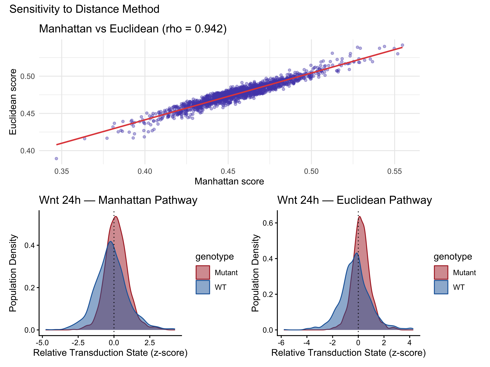
